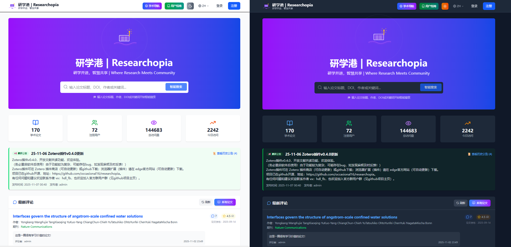
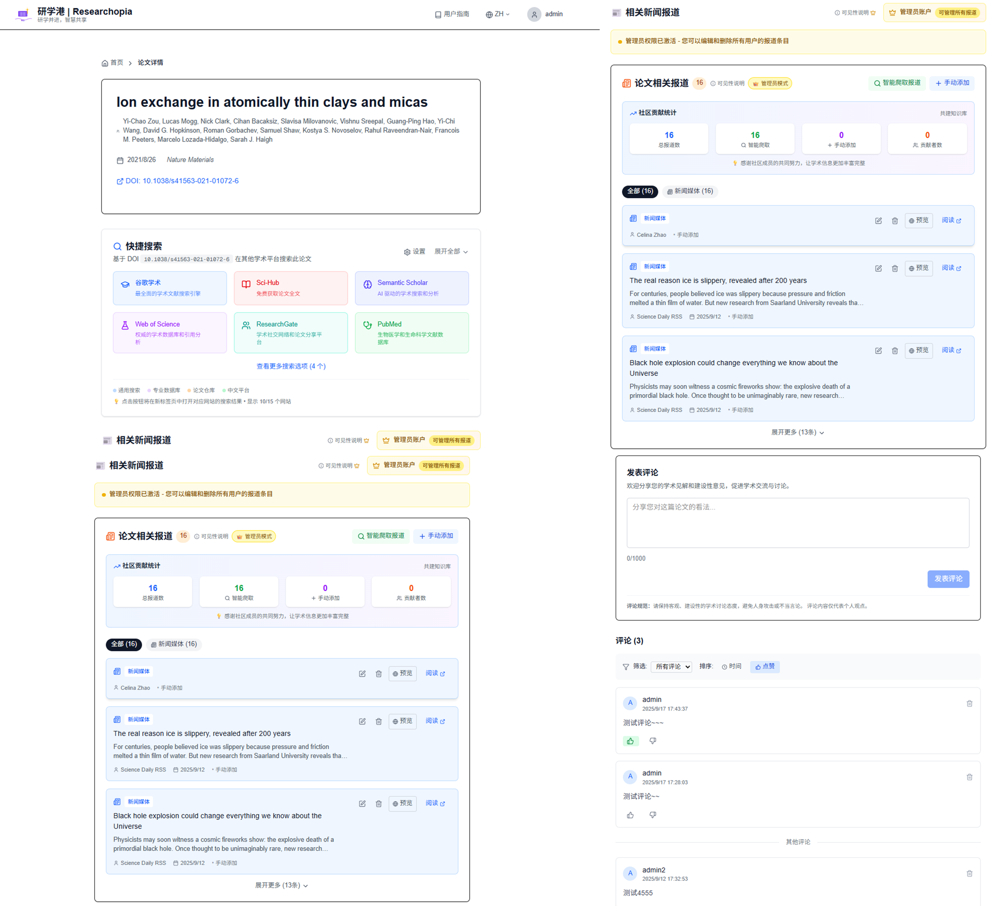
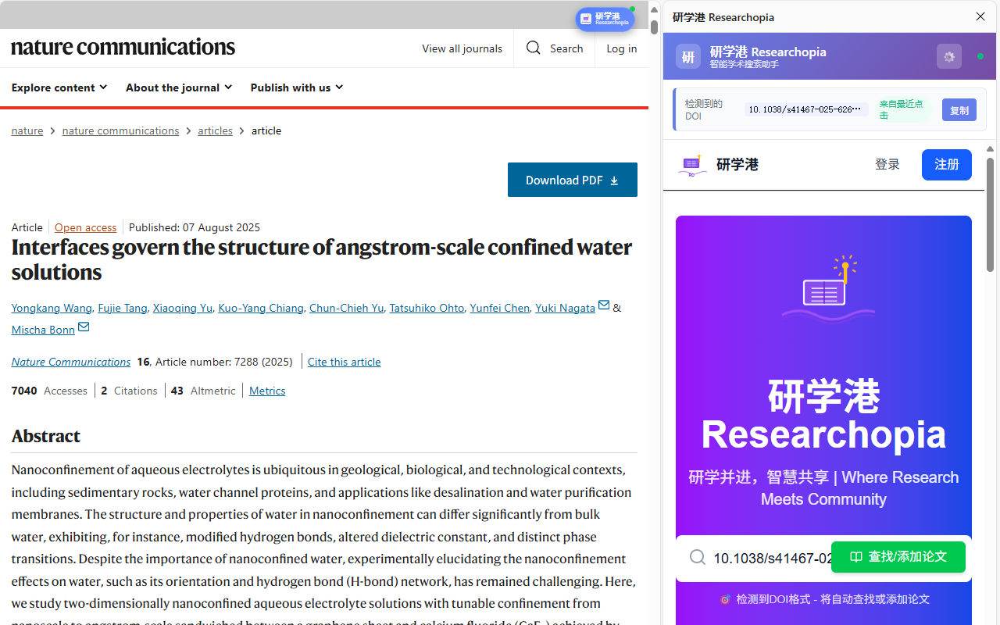
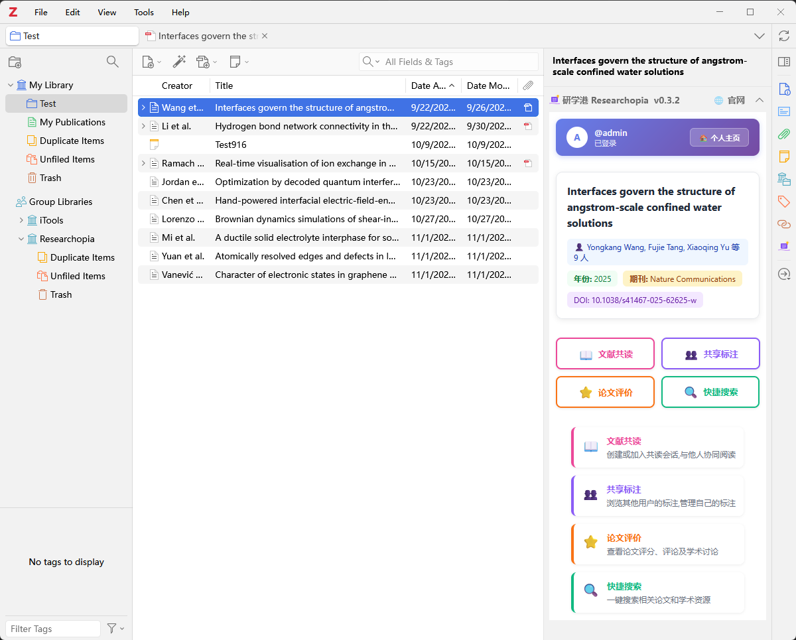

<!-- markdownlint-disable first-line-h1 -->
<!-- markdownlint-disable html -->
<!-- markdownlint-disable no-duplicate-header -->


<div align="center">

  <a href="https://www.researchopia.com/" target="_blank">
    
  </a>

  [](https://www.zotero.org) 
  [](https://github.com/occasional16/researchopia/releases)
  
  [](https://github.com/windingwind/zotero-plugin-template)
  <a href="https://github.com/occasional16/researchopia/blob/main/LICENSE"></a>
  [![zread](https://img.shields.io/badge/Ask_Zread-_.svg?style=flat&color=00b0aa&labelColor=000000&logo=data%3Aimage%2Fsvg%2Bxml%3Bbase64%2CPHN2ZyB3aWR0aD0iMTYiIGhlaWdodD0iMTYiIHZpZXdCb3g9IjAgMCAxNiAxNiIgZmlsbD0ibm9uZSIgeG1sbnM9Imh0dHA6Ly93d3cudzMub3JnLzIwMDAvc3ZnIj4KPHBhdGggZD0iTTQuOTYxNTYgMS42MDAxSDIuMjQxNTZDMS44ODgxIDEuNjAwMSAxLjYwMTU2IDEuODg2NjQgMS42MDE1NiAyLjI0MDFWNC45NjAxQzEuNjAxNTYgNS4zMTM1NiAxLjg4ODEgNS42MDAxIDIuMjQxNTYgNS42MDAxSDQuOTYxNTZDNS4zMTUwMiA1LjYwMDEgNS42MDE1NiA1LjMxMzU2IDUuNjAxNTYgNC45NjAxVjIuMjQwMUM1LjYwMTU2IDEuODg2NjQgNS4zMTUwMiAxLjYwMDEgNC45NjE1NiAxLjYwMDFaIiBmaWxsPSIjZmZmIi8%2BCjxwYXRoIGQ9Ik00Ljk2MTU2IDEwLjM5OTlIMi4yNDE1NkMxLjg4ODEgMTAuMzk5OSAxLjYwMTU2IDEwLjY4NjQgMS42MDE1NiAxMS4wMzk5VjEzLjc1OTlDMS42MDE1NiAxNC4xMTM0IDEuODg4MSAxNC4zOTk5IDIuMjQxNTYgMTQuMzk5OUg0Ljk2MTU2QzUuMzE1MDIgMTQuMzk5OSA1LjYwMTU2IDE0LjExMzQgNS42MDE1NiAxMy43NTk5VjExLjAzOTlDNS42MDE1NiAxMC42ODY0IDUuMzE1MDIgMTAuMzk5OSA0Ljk2MTU2IDEwLjM5OTlaIiBmaWxsPSIjZmZmIi8%2BCjxwYXRoIGQ9Ik0xMy43NTg0IDEuNjAwMUgxMS4wMzg0QzEwLjY4NSAxLjYwMDEgMTAuMzk4NCAxLjg4NjY0IDEwLjM5ODQgMi4yNDAxVjQuOTYwMUMxMC4zOTg0IDUuMzEzNTYgMTAuNjg1IDUuNjAwMSAxMS4wMzg0IDUuNjAwMUgxMy43NTg0QzE0LjExMTkgNS42MDAxIDE0LjM5ODQgNS4zMTM1NiAxNC4zOTg0IDQuOTYwMVYyLjI0MDFDMTQuMzk4NCAxLjg4NjY0IDE0LjExMTkgMS42MDAxIDEzLjc1ODQgMS42MDAxWiIgZmlsbD0iI2ZmZiIvPgo8cGF0aCBkPSJNNCAxMkwxMiA0TDQgMTJaIiBmaWxsPSIjZmZmIi8%2BCjxwYXRoIGQ9Ik00IDEyTDEyIDQiIHN0cm9rZT0iI2ZmZiIgc3Ryb2tlLXdpZHRoPSIxLjUiIHN0cm9rZS1saW5lY2FwPSJyb3VuZCIvPgo8L3N2Zz4K&logoColor=ffffff)](https://zread.ai/occasional16/researchopia)

  <font size="5"> **研学港 | Researchopia - 开放的学术交流和共享平台** </font> 

  <font size="4"> **研学并进，智慧共享 | Where Research Meets Community** </font> 

  [🌐 官方网站](https://www.researchopia.com) | [📄 用户指南](/docs/USER-GUIDE.md) | [🤝 贡献指南](./docs/CONTRIBUTING.md)

</div>


## 🧩 目录 Contents

- [🧩 目录 Contents](#-目录-contents)
- [📋 项目简介](#-项目简介)
  - [🌟 项目组成](#-项目组成)
  - [🤖 AI驱动开发](#-ai驱动开发)
  - [💬 社区与交流](#-社区与交流)
- [⚡ 快速开始](#-快速开始)
  - [✨ 核心功能](#-核心功能)
  - [🌐 网站平台](#-网站平台)
  - [📱 浏览器扩展](#-浏览器扩展)
  - [📚 Zotero 插件](#-zotero-插件)
- [🚀 开发环境搭建](#-开发环境搭建)
  - [前置要求](#前置要求)
  - [快速开始](#快速开始)
  - [Zotero插件开发 (可选)](#zotero插件开发-可选)
  - [浏览器扩展开发 (可选)](#浏览器扩展开发-可选)
- [📝 相关文档](#-相关文档)
- [🔧 开发指南](#-开发指南)
  - [🤝 贡献指南](#-贡献指南)
  - [📁 项目结构](#-项目结构)
  - [🛠 技术栈](#-技术栈)
- [📄 许可证](#-许可证)
- [📞 联系方式](#-联系方式)


## 📋 项目简介

欢迎来到 **研学港 Researchopia** ！ **研学港 Researchopia** 是一个开放的学术交流和共享平台（开源项目），旨在为研究者提供优质的学术资源和交流环境。我们致力于构建一个研究者的理想国，让学术智慧在这里汇聚和传播。

### 🌟 项目组成

本项目采用**Monorepo架构**，包含三个核心组件：

1. **🌐 网站（Next.js）** ([www.researchopia.com](https://www.researchopia.com))
   - 在线论文搜索和评价平台
   - 学术标注社区
   
2. **📚 Zotero 插件** (https://www.researchopia.com/updates)
   - 嵌入 Zotero 8/7 的原生插件
   - 实时文献共读会话
   - 自动同步 PDF 标注到云端
   - 实时会话协作功能
   
3. **📱 浏览器扩展** ([Edge Store](https://microsoftedge.microsoft.com/addons/detail/%E7%A0%94%E5%AD%A6%E6%B8%AF-researchopia/hjijphegihgkddcmdmfjpflpcdaadbio))
   - 智能 DOI 检测
   - 侧边栏快速预览
   - 一键搜索论文

具体功能请参考 [用户指南](https://www.researchopia.com/guide)。

### 🤖 AI驱动开发

本项目正式启动于2025-09-08，作者是一名刚博士毕业的科研狗（化学领域），没有编程基础，也没有报过AI课程。**本项目的编程部分100%由AI工具生成** （项目架构、名称、logo和slogan也由AI设计）。

一开始我还不懂什么叫网站前后端也不懂VS code，但第一天时间就完成了网站基本的界面设计和数据库搭建。浏览器扩展和zotero插件的第一版真的是各用一句话直接生成。当然，进一步的细节打磨和bug处理是花了更多的时间。这段时间也渐渐学到了一些编程知识，也积累了一些与AI对话的经验和小窍门。目前项目处于初期阶段，后续会持续优化和完善。

### 💬 社区与交流

想要近距离了解本项目开发意图和计划，有任何开发和使用上的建议和反馈，或者想了解AI开发的细节的小伙伴，欢迎加我的个人微信、微信公众号（观物AI），也欢迎加入用户群：

<div align="center">
  
  
    
  
</div> 

---

## ⚡ 快速开始

### ✨ 核心功能

详细内容请看 [用户指南](/docs/USER-GUIDE.md) 。

**🌐 Next.js 网站平台**
- **论文搜索与管理**: DOI/关键词搜索，智能推荐
- **标注共享社区**: 查看和分享学术标注，社交互动
- **实时协作**: 文献共读会话，多人同步阅读
- **学术社交**: 关注研究者，评论互动，学术讨论

**📚 Zotero 插件**
- **无缝集成**: 嵌入 Zotero 8 item pane
- **标注同步**: 自动同步 PDF 标注到云端
- **实时会话**: 创建/加入共读会话，实时标注共享
- **社区互动**: 查看他人标注，点赞评论

**📱 浏览器扩展**
- **智能 DOI 检测**: 自动识别学术网页中的 DOI
- **悬浮工具**: 拖拽式浮动图标，快速访问
- **侧边栏集成**: 在任意网页打开研学港
- **快速搜索**: 一键搜索检测到的 DOI

### 🌐 网站平台

- **官方网站**: [https://www.researchopia.com](https://www.researchopia.com)

主页：



论文详情页：



个人中心页：


### 📱 浏览器扩展

研学港提供 Chrome/Edge 浏览器扩展，支持：

- 自动检测学术论文 DOI
- 一键搜索论文评价
- 侧边栏快速预览
- 浮动图标便捷访问



**安装扩展：**

1. 打开浏览器扩展管理页面
2. 启用"开发者模式"
3. 选择"加载已解压的扩展程序"
4. 选择项目中的 `extension` 文件夹

### 📚 Zotero 插件

集成 Zotero 文献管理器，在 Zotero 中直接查看论文评价。



**安装 Zotero 插件：**

在Zotero插件商店内直接下载安装，或下载xpi文件，在 Zotero > Tools > Plugins 中安装。

---

## 🚀 开发环境搭建

### 前置要求
- **Node.js**: v18.0.0+ 
- **npm**: v9.0.0+
- **Zotero**: v7 或 v8 Beta (插件开发)

### 快速开始

```bash
# 1. 克隆仓库并安装依赖
git clone https://github.com/occasional16/researchopia.git
cd researchopia
npm install

# 2. 配置环境变量
cp .env.example .env.local
# 编辑 .env.local 填写必填项:
# - NEXT_PUBLIC_SUPABASE_URL
# - SUPABASE_SERVICE_ROLE_KEY

# 3. 启动开发服务器
npm run dev
# 访问 http://localhost:3000
```

### Zotero插件开发 (可选)
```bash
cd zotero-plugin
npm install

# 配置Zotero路径
cp .env.template .env
# 编辑 .env: ZOTERO_PLUGIN_ZOTERO_BIN_PATH=C:\Program Files\Zotero\zotero.exe

# 启动热重载
npm start
```

### 浏览器扩展开发 (可选)
```bash
# Chrome/Edge: 扩展管理 → 开发者模式 → 加载已解压的扩展
# 选择 extension/ 目录
```

**详细开发指南**: [DEVELOPMENT.md](./docs/DEVELOPMENT.md)  
**贡献流程**: [CONTRIBUTING.md](./docs/CONTRIBUTING.md)

---

## 📝 相关文档

> **🗂️ 完整文档导航**: [文档索引和规范](./docs/README.md) - 查看所有文档和编写规范

**核心文档：**
- [架构说明](./docs/ARCHITECTURE.md) - 整体架构、数据库设计、技术栈
- [开发指南](./docs/DEVELOPMENT.md) - Next.js、Zotero插件、浏览器扩展开发
- [贡献指南](./docs/CONTRIBUTING.md) - 开发规范、Git工作流、PR流程
- [用户指南](./docs/USER-GUIDE.md) - 网站、插件、扩展使用教程
- [API 文档](./docs/API.md) - 所有API端点、认证、错误处理
- [问题排查](./docs/TROUBLESHOOTING.md) - 常见问题和解决方案

**多语言：**
- [English README](./docs/README-en.md)


## 🔧 开发指南

### 🤝 贡献指南
欢迎添加作者微信，或提交 Issue 和 Pull Request 来帮助改进项目！请查看 [贡献指南](./docs/CONTRIBUTING.md) 了解详情。

更多信息请参考:
- [开发指南](./docs/DEVELOPMENT.md) - 详细技术文档
- [贡献指南](./docs/CONTRIBUTING.md) - 开发流程和规范
- [架构说明](./docs/ARCHITECTURE.md) - 系统架构和数据库设计

### 📁 项目结构

```
📁 Researchopia/ (Monorepo)
├── 📁 src/                  # 🌐 Next.js 网站源码 (278 文件)
│   ├── 📁 app/              # App Router 页面
│   ├── 📁 components/       # React 组件
│   ├── 📁 lib/              # 工具库和配置
│   ├── 📁 hooks/            # 自定义 Hooks
│   ├── 📁 utils/            # 工具函数
│   └── 📁 types/            # TypeScript 类型定义
├── 📁 zotero-plugin/        # 📚 Zotero 插件 (168 文件) ⭐
│   ├── 📁 src/              # 插件源码
│   │   ├── 📁 modules/      # 业务模块 (46+ 子模块)
│   │   │   ├── 📁 ui/       # UI视图层 (高度模块化)
│   │   │   ├── 📁 pdf/      # PDF管理 (V2架构)
│   │   │   └── ...
│   │   ├── 📁 utils/        # 工具函数
│   │   ├── 📁 config/       # 配置文件
│   │   └── 📁 adapters/     # 适配器层
│   ├── 📁 addon/            # 插件资源文件
│   ├── package.json         # 插件依赖
│   └── tsconfig.json        # TypeScript 配置
├── 📁 extension/            # 📱 浏览器扩展 (12 文件)
│   ├── manifest.json        # 扩展清单 (MV3)
│   ├── background.js        # 后台脚本
│   ├── content.js           # 内容脚本
│   ├── popup.html/js        # 弹窗界面
│   ├── sidebar.html/js      # 侧边栏
│   └── 📁 icons/            # 图标资源
├── 📁 docs/                 # 📖 项目文档
│   ├── 📁 docs-dev/         # 开发文档 (架构、重构记录)
│   ├── ARCHITECTURE.md      # 架构说明
│   ├── DEVELOPMENT.md       # 开发指南
│   ├── CONTRIBUTING.md      # 贡献指南
│   └── USER-GUIDE.md        # 用户指南
├── 📁 public/               # 静态资源文件
├── 📁 .github/              # GitHub 配置
│   └── copilot-instructions.md  # AI开发指南
├── package.json             # 根依赖 (统一版本管理)
└── tsconfig.json            # 根 TypeScript 配置
```

### 🛠 技术栈

**🌐 Next.js 网站**
- **Next.js 16.0.1** - React 框架，App Router
- **TypeScript** - 类型安全
- **Tailwind CSS** - 样式框架
- **Supabase** - 后端服务 (Auth + Database + Realtime)
- **React Query** - 数据获取和状态管理
- **WebSocket** - 实时通信
- **Vercel** - 部署平台

**📚 Zotero 插件**
- **[Zotero Plugin Template](https://github.com/windingwind/zotero-plugin-template)** - 官方插件模版
- **TypeScript** - 插件开发语言
- **Zotero Plugin Toolkit 5.1** - 官方工具库
- **Mozilla/XUL** - Zotero UI 框架
- **Supabase JS SDK** - 云端数据同步

**📱 浏览器扩展**
- **Manifest V3** - Chrome 扩展最新标准
- **Vanilla JavaScript** - 轻量高效 (计划迁移至 TypeScript + Vite)

---


## 📄 许可证

本项目采用 [AGPL-3.0-or-later](LICENSE) 许可证。

---


## 📞 联系方式

- **项目维护**: Researchopia Team
- **技术支持**: 通过 GitHub Issues
- **反馈建议**: 欢迎在平台上提交

- **网站**: [https://www.researchopia.com](https://www.researchopia.com)
- **GitHub**: [https://github.com/occasional16/researchopia](https://github.com/occasional16/researchopia)
- **技术支持 + 反馈建议**: 欢迎添加作者微信，加入项目群，或在平台上反馈。


---

**Made with ❤️ for the research community**

**研学港 Researchopia** - 研学并进，智慧共享 | Where Research Meets Community。
