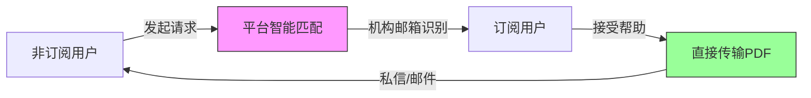

# 学术互助配对平台方案设计

## 文档信息
- **版本**: v1.0
- **创建时间**: 2025-01-07
- **状态**: 待审核
- **优先级**: 高
- **关联文档**: `2-DOI_FULLTEXT_RETRIEVAL_RESEARCH.md`

---

## 1. 核心理念

### 1.1 定位
**"撮合中介"而非"文件托管平台"**

```
平台职责 = 连接订阅用户与非订阅用户 + 提供通信渠道
平台NOT = 存储PDF + 分发PDF
```

### 1.2 核心机制


**关键特征**：
- 🎯 **精准匹配**：通过机构邮箱自动识别订阅用户
- 🤝 **用户自主**：志愿者自愿选择是否帮助，平台不强制
- 🔒 **隐私保护**：双方身份匿名，仅通过平台通道通信
- ⏱️ **临时存储**：如使用平台传输，文件24小时后自动删除
- ✅ **法律隔离**：文件传输发生在用户间，平台不托管、不公开分发

### 1.3 📋 完整用户流程

**非订阅用户（请求者）**

```
1. 在Zotero插件点击"请求全文"
   ↓
2. 填写简短说明（可选）："需要用于课程论文写作"
   ↓
3. 系统自动匹配有订阅的用户
   ↓
4. 等待通知（预计15分钟内）
   ↓
5. 收到通知："有志愿者愿意帮助！"
   ↓
6. 选择接收方式：
   - 通过平台私信（自动下载到Zotero）
   - 通过临时邮箱（系统自动生成 temp_12345@researchopia.com）
   ↓
7. 收到PDF，自动附加到Zotero条目
   ↓
8. （可选）给志愿者好评 + 感谢留言
```

**订阅用户（志愿者）**

```
1. 收到通知："有用户需要帮助"
   ↓
2. 查看论文信息（匿名请求）
   ↓
3. 确认"我愿意帮助"
   ↓
4. 系统引导：
   - "请确认您通过合法途径（个人订阅/OA）获取此文献"
   - "请勿使用机构订阅批量下载"
   ↓
5. 上传PDF或提供下载链接
   ↓
6. 系统自动通知请求者
   ↓
7. 获得积分奖励 + 志愿者徽章
```

### 1.4 🛡️ 增强合规措施

**明确用户协议**

```
### 志愿者声明（必须勾选才能上传）
□ 我确认此文献来自以下合法途径之一：
  - 开放获取（Open Access）资源
  - 我的个人订阅账号
  - 作者本人授权分享
  - 其他合法公开渠道

□ 我理解不得使用机构订阅账号系统性下载并分发论文

□ 我同意对上传内容的合法性负责
```

**技术限制**

- 每个用户每天最多帮助5次（防止成为"文献批发商"）
- 同一DOI的请求间隔至少24小时（防止滥用）
- 高风险出版商（Nature、Science）需额外确认


---

## 2. 技术架构设计

### 2.1 系统架构图

```
┌────────────────────────────────────────────────────┐
│                  前端层                             │
│  ┌──────────────┐  ┌──────────────┐               │
│  │ Zotero插件   │  │  Web网站     │               │
│  │ (请求全文)   │  │ (互助社区)   │               │
│  └──────────────┘  └──────────────┘               │
└────────────────────────────────────────────────────┘
                         ↓
┌────────────────────────────────────────────────────┐
│                  API层                              │
│  ┌──────────────┐  ┌──────────────┐               │
│  │ 请求管理API  │  │  匹配引擎API │               │
│  │ /api/request │  │ /api/matcher │               │
│  └──────────────┘  └──────────────┘               │
│  ┌──────────────┐  ┌──────────────┐               │
│  │ 通知系统API  │  │  文件传输API │               │
│  │ /api/notify  │  │ /api/transfer│               │
│  └──────────────┘  └──────────────┘               │
└────────────────────────────────────────────────────┘
                         ↓
┌────────────────────────────────────────────────────┐
│                  业务逻辑层                         │
│  ┌──────────────┐  ┌──────────────┐               │
│  │ 机构验证     │  │  智能配对     │               │
│  │ 邮箱识别     │  │  优先级排序   │               │
│  └──────────────┘  └──────────────┘               │
│  ┌──────────────┐  ┌──────────────┐               │
│  │ 风险评估     │  │  积分系统     │               │
│  │ 滥用检测     │  │  信誉管理     │               │
│  └──────────────┘  └──────────────┘               │
└────────────────────────────────────────────────────┘
                         ↓
┌────────────────────────────────────────────────────┐
│                  数据层                             │
│  ┌──────────────┐  ┌──────────────┐               │
│  │ PostgreSQL   │  │  Redis       │               │
│  │ (用户、请求) │  │ (缓存、队列) │               │
│  └──────────────┘  └──────────────┘               │
│  ┌──────────────┐  ┌──────────────┐               │
│  │ S3/OSS       │  │  WebSocket   │               │
│  │ (临时文件)   │  │ (实时通知)   │               │
│  └──────────────┘  └──────────────┘               │
└────────────────────────────────────────────────────┘
```

### 2.2 数据库设计

#### 2.2.1 核心表结构

```sql
-- 用户表
CREATE TABLE users (
  id UUID PRIMARY KEY DEFAULT gen_random_uuid(),
  email VARCHAR(255) UNIQUE NOT NULL,
  username VARCHAR(100),
  
  -- 机构信息
  institution_id UUID REFERENCES institutions(id),
  is_verified BOOLEAN DEFAULT FALSE, -- 是否通过机构邮箱验证
  verification_date TIMESTAMP,
  
  -- 订阅信息（用户自行声明）
  subscriptions JSONB, -- ['Springer', 'Elsevier', 'Wiley']
  
  -- 互助统计
  help_provided_count INTEGER DEFAULT 0, -- 帮助他人次数
  help_received_count INTEGER DEFAULT 0, -- 被帮助次数
  reputation_score DECIMAL(3,2) DEFAULT 0.0, -- 0.00 - 5.00
  
  -- 状态控制
  is_available BOOLEAN DEFAULT TRUE, -- 是否愿意接受帮助请求
  last_help_time TIMESTAMP, -- 上次帮助时间（防过载）
  
  created_at TIMESTAMP DEFAULT NOW(),
  updated_at TIMESTAMP DEFAULT NOW()
);

-- 机构表
CREATE TABLE institutions (
  id UUID PRIMARY KEY DEFAULT gen_random_uuid(),
  name VARCHAR(255) NOT NULL,
  country VARCHAR(100),
  
  -- 邮箱域名
  email_domains TEXT[], -- ['mit.edu', 'csail.mit.edu']
  
  -- 订阅信息（机构级别）
  known_subscriptions JSONB, -- {'publishers': ['Springer', 'Nature']}
  
  -- 统计信息
  member_count INTEGER DEFAULT 0,
  total_helps INTEGER DEFAULT 0,
  
  created_at TIMESTAMP DEFAULT NOW()
);

-- 论文请求表
CREATE TABLE paper_requests (
  id UUID PRIMARY KEY DEFAULT gen_random_uuid(),
  
  -- 论文信息
  doi VARCHAR(255) NOT NULL,
  title TEXT,
  publisher VARCHAR(100),
  
  -- 请求者信息
  requester_id UUID REFERENCES users(id) NOT NULL,
  reason TEXT, -- 可选：请求理由
  
  -- 状态管理
  status VARCHAR(20) DEFAULT 'pending', -- pending, matched, completed, cancelled
  
  -- 匹配信息
  helper_id UUID REFERENCES users(id),
  matched_at TIMESTAMP,
  completed_at TIMESTAMP,
  
  -- 传输信息
  transfer_method VARCHAR(20), -- 'platform', 'email', 'external'
  file_url TEXT, -- 临时下载链接（24小时有效）
  file_expires_at TIMESTAMP,
  
  -- 评价信息
  rating INTEGER, -- 1-5星
  feedback TEXT,
  
  -- 风险评估
  risk_level VARCHAR(10), -- LOW, MEDIUM, HIGH
  flagged BOOLEAN DEFAULT FALSE,
  
  created_at TIMESTAMP DEFAULT NOW(),
  updated_at TIMESTAMP DEFAULT NOW()
);

-- 私信通道表（匿名通信）
CREATE TABLE private_channels (
  id UUID PRIMARY KEY DEFAULT gen_random_uuid(),
  request_id UUID REFERENCES paper_requests(id) NOT NULL,
  
  -- 双方匿名标识
  requester_alias VARCHAR(50), -- 'User_A1B2C3'
  helper_alias VARCHAR(50), -- 'Helper_X9Y8Z7'
  
  -- 临时邮箱（可选）
  temp_email VARCHAR(255), -- 'temp_12345@researchopia.com'
  
  -- 状态
  is_active BOOLEAN DEFAULT TRUE,
  expires_at TIMESTAMP, -- 任务完成后24小时过期
  
  created_at TIMESTAMP DEFAULT NOW()
);

-- 消息表（私信内容）
CREATE TABLE channel_messages (
  id UUID PRIMARY KEY DEFAULT gen_random_uuid(),
  channel_id UUID REFERENCES private_channels(id) NOT NULL,
  
  sender_type VARCHAR(10), -- 'requester' or 'helper'
  message_text TEXT,
  attachment_url TEXT, -- PDF链接（临时存储）
  
  is_read BOOLEAN DEFAULT FALSE,
  created_at TIMESTAMP DEFAULT NOW()
);

-- 操作日志（审计用）
CREATE TABLE audit_logs (
  id UUID PRIMARY KEY DEFAULT gen_random_uuid(),
  user_id UUID REFERENCES users(id),
  action VARCHAR(50), -- 'request_created', 'help_provided', 'file_uploaded'
  details JSONB,
  ip_address INET,
  user_agent TEXT,
  created_at TIMESTAMP DEFAULT NOW()
);
```

#### 2.2.2 索引优化

```sql
-- 快速查找可用志愿者
CREATE INDEX idx_users_available ON users(is_verified, is_available, last_help_time)
  WHERE is_verified = TRUE AND is_available = TRUE;

-- 按机构聚合统计
CREATE INDEX idx_users_institution ON users(institution_id);

-- 快速查找待匹配请求
CREATE INDEX idx_requests_pending ON paper_requests(status, created_at)
  WHERE status = 'pending';

-- DOI去重检查
CREATE INDEX idx_requests_doi ON paper_requests(doi, requester_id, created_at);
```

---

## 3. 核心功能模块

### 3.1 机构验证模块

```typescript
// src/lib/institutional-verification.ts
import { supabase } from './supabase';

export class InstitutionalVerification {
  /**
   * 检测邮箱域名是否属于学术机构
   */
  async detectInstitution(email: string): Promise<Institution | null> {
    const domain = email.split('@')[1];
    
    // 查询机构表
    const { data: institution } = await supabase
      .from('institutions')
      .select('*')
      .contains('email_domains', [domain])
      .single();
    
    return institution;
  }
  
  /**
   * 发送验证邮件
   */
  async sendVerificationEmail(userId: string, email: string): Promise<string> {
    const verificationCode = this.generateCode();
    
    // 存储验证码（Redis，10分钟有效）
    await redis.setex(
      `verification:${userId}`,
      600,
      verificationCode
    );
    
    // 发送邮件
    await sendEmail({
      to: email,
      subject: 'Researchopia 机构邮箱验证',
      template: 'verification',
      data: {
        code: verificationCode,
        expires_in: '10分钟'
      }
    });
    
    return verificationCode;
  }
  
  /**
   * 验证用户输入的验证码
   */
  async verifyCode(userId: string, inputCode: string): Promise<boolean> {
    const storedCode = await redis.get(`verification:${userId}`);
    
    if (storedCode === inputCode) {
      // 更新用户验证状态
      await supabase
        .from('users')
        .update({
          is_verified: true,
          verification_date: new Date()
        })
        .eq('id', userId);
      
      // 删除验证码
      await redis.del(`verification:${userId}`);
      
      return true;
    }
    
    return false;
  }
  
  /**
   * 生成6位数字验证码
   */
  private generateCode(): string {
    return Math.floor(100000 + Math.random() * 900000).toString();
  }
}
```

### 3.2 智能配对模块

```typescript
// src/lib/request-matcher.ts
import { supabase } from './supabase';

export class RequestMatcher {
  /**
   * 为请求匹配合适的志愿者
   */
  async matchRequest(requestId: string): Promise<User[]> {
    // 1. 获取请求详情
    const { data: request } = await supabase
      .from('paper_requests')
      .select('*, requester:users(*)')
      .eq('id', requestId)
      .single();
    
    if (!request) throw new Error('Request not found');
    
    // 2. 检测出版商
    const publisher = await this.detectPublisher(request.doi);
    
    // 3. 查找有该出版商订阅的用户
    const { data: eligibleUsers } = await supabase
      .from('users')
      .select('*')
      .eq('is_verified', true)
      .eq('is_available', true)
      .contains('subscriptions', [publisher])
      .neq('id', request.requester_id) // 排除请求者自己
      .order('help_provided_count', { ascending: true }) // 优先帮助次数少的
      .limit(10);
    
    // 4. 过滤最近帮助过的用户（30分钟冷却期）
    const now = Date.now();
    const availableUsers = eligibleUsers?.filter(user => {
      if (!user.last_help_time) return true;
      const cooldown = 30 * 60 * 1000; // 30分钟
      return now - new Date(user.last_help_time).getTime() > cooldown;
    }) || [];
    
    return availableUsers;
  }
  
  /**
   * 通知匹配的志愿者
   */
  async notifyVolunteers(request: PaperRequest, users: User[]): Promise<void> {
    const notifications = users.map(user => ({
      user_id: user.id,
      type: 'help_request',
      title: '有用户需要您的帮助',
      message: `有用户需要获取论文：\n《${request.title}》\nDOI: ${request.doi}`,
      action_url: `/help/request/${request.id}`,
      created_at: new Date()
    }));
    
    // 批量插入通知
    await supabase.from('notifications').insert(notifications);
    
    // WebSocket实时推送
    users.forEach(user => {
      websocket.send(user.id, {
        type: 'new_help_request',
        request_id: request.id,
        doi: request.doi,
        title: request.title
      });
    });
  }
  
  /**
   * 检测DOI所属出版商
   */
  private async detectPublisher(doi: string): Promise<string> {
    // 通过Crossref API检测
    const response = await fetch(
      `https://api.crossref.org/works/${doi}`
    );
    const data = await response.json();
    
    return data.message.publisher || 'Unknown';
  }
}
```

### 3.3 风险评估模块

```typescript
// src/lib/risk-assessment.ts
export class RiskAssessment {
  /**
   * 评估请求的风险等级
   */
  async assessRequest(requestId: string): Promise<RiskLevel> {
    const { data: request } = await supabase
      .from('paper_requests')
      .select('*, requester:users(*)')
      .eq('id', requestId)
      .single();
    
    let riskScore = 0;
    const reasons: string[] = [];
    
    // 1. 出版商风险
    const publisher = await detectPublisher(request.doi);
    const highRiskPublishers = ['Nature', 'Science', 'Cell', 'Lancet'];
    if (highRiskPublishers.includes(publisher)) {
      riskScore += 3;
      reasons.push(`高风险出版商: ${publisher}`);
    }
    
    // 2. 用户历史
    const user = request.requester;
    if (user.help_received_count > 10 && user.reputation_score < 3.0) {
      riskScore += 2;
      reasons.push('用户评分低但请求频繁');
    }
    
    // 3. 请求频率（7天内）
    const sevenDaysAgo = new Date(Date.now() - 7 * 24 * 60 * 60 * 1000);
    const { count: recentCount } = await supabase
      .from('paper_requests')
      .select('*', { count: 'exact', head: true })
      .eq('requester_id', user.id)
      .gte('created_at', sevenDaysAgo.toISOString());
    
    if (recentCount && recentCount > 15) {
      riskScore += 5;
      reasons.push(`7天内请求${recentCount}次`);
    }
    
    // 4. 同一DOI重复请求
    const { count: sameDoiCount } = await supabase
      .from('paper_requests')
      .select('*', { count: 'exact', head: true })
      .eq('requester_id', user.id)
      .eq('doi', request.doi);
    
    if (sameDoiCount && sameDoiCount > 1) {
      riskScore += 2;
      reasons.push('同一DOI重复请求');
    }
    
    // 计算风险等级
    let level: RiskLevel;
    if (riskScore >= 7) {
      level = 'HIGH';
    } else if (riskScore >= 4) {
      level = 'MEDIUM';
    } else {
      level = 'LOW';
    }
    
    // 更新请求风险等级
    await supabase
      .from('paper_requests')
      .update({
        risk_level: level,
        flagged: level === 'HIGH'
      })
      .eq('id', requestId);
    
    // 记录评估日志
    await logRiskAssessment({
      request_id: requestId,
      risk_score: riskScore,
      risk_level: level,
      reasons: reasons
    });
    
    return level;
  }
}

type RiskLevel = 'LOW' | 'MEDIUM' | 'HIGH';
```

### 3.4 文件传输模块

```typescript
// src/lib/file-transfer.ts
import { S3Client, PutObjectCommand } from '@aws-sdk/client-s3';

export class FileTransfer {
  private s3Client: S3Client;
  
  constructor() {
    this.s3Client = new S3Client({
      region: process.env.AWS_REGION,
      credentials: {
        accessKeyId: process.env.AWS_ACCESS_KEY_ID!,
        secretAccessKey: process.env.AWS_SECRET_ACCESS_KEY!
      }
    });
  }
  
  /**
   * 上传PDF到临时存储（24小时有效）
   */
  async uploadTemporaryFile(
    file: File,
    requestId: string
  ): Promise<TemporaryFileResult> {
    // 1. 端到端加密
    const encryptedBuffer = await this.encryptFile(file);
    
    // 2. 生成唯一文件名
    const fileName = `temp/${requestId}/${Date.now()}_${file.name}`;
    
    // 3. 上传到S3（设置24小时过期）
    await this.s3Client.send(new PutObjectCommand({
      Bucket: process.env.AWS_S3_BUCKET,
      Key: fileName,
      Body: encryptedBuffer,
      ContentType: 'application/pdf',
      Metadata: {
        'request-id': requestId,
        'uploaded-at': new Date().toISOString()
      },
      // 24小时后自动删除
      Expires: new Date(Date.now() + 24 * 60 * 60 * 1000)
    }));
    
    // 4. 生成一次性下载链接
    const downloadLink = await this.generateOneTimeLink({
      fileName,
      requestId,
      expiresIn: 24 * 60 * 60 * 1000
    });
    
    // 5. 更新请求记录
    await supabase
      .from('paper_requests')
      .update({
        file_url: downloadLink,
        file_expires_at: new Date(Date.now() + 24 * 60 * 60 * 1000),
        transfer_method: 'platform'
      })
      .eq('id', requestId);
    
    return {
      downloadLink,
      expiresAt: new Date(Date.now() + 24 * 60 * 60 * 1000)
    };
  }
  
  /**
   * 生成一次性下载链接（只能下载一次）
   */
  private async generateOneTimeLink(params: {
    fileName: string;
    requestId: string;
    expiresIn: number;
  }): Promise<string> {
    // 生成唯一token
    const token = crypto.randomUUID();
    
    // 存储token（Redis）
    await redis.setex(
      `download:${token}`,
      params.expiresIn / 1000, // 转为秒
      JSON.stringify({
        file_name: params.fileName,
        request_id: params.requestId,
        downloaded: false
      })
    );
    
    // 返回带token的下载链接
    return `${process.env.WEB_URL}/api/download/${token}`;
  }
  
  /**
   * 处理下载请求（验证一次性token）
   */
  async handleDownload(token: string, userId: string): Promise<FileStream> {
    // 1. 验证token
    const dataStr = await redis.get(`download:${token}`);
    if (!dataStr) {
      throw new Error('下载链接已过期或无效');
    }
    
    const data = JSON.parse(dataStr);
    
    // 2. 检查是否已下载
    if (data.downloaded) {
      throw new Error('此链接已被使用，不能重复下载');
    }
    
    // 3. 验证用户权限
    const { data: request } = await supabase
      .from('paper_requests')
      .select('requester_id')
      .eq('id', data.request_id)
      .single();
    
    if (request.requester_id !== userId) {
      throw new Error('无权下载此文件');
    }
    
    // 4. 标记为已下载
    await redis.set(
      `download:${token}`,
      JSON.stringify({ ...data, downloaded: true })
    );
    
    // 5. 从S3获取文件流
    const fileStream = await this.getFileStream(data.file_name);
    
    // 6. 解密
    const decryptedStream = await this.decryptFileStream(fileStream);
    
    // 7. 记录下载日志
    await logDownload({
      request_id: data.request_id,
      user_id: userId,
      file_name: data.file_name
    });
    
    return decryptedStream;
  }
  
  /**
   * 加密文件（AES-256-GCM）
   */
  private async encryptFile(file: File): Promise<Buffer> {
    const key = Buffer.from(process.env.ENCRYPTION_KEY!, 'hex');
    const iv = crypto.randomBytes(16);
    
    const cipher = crypto.createCipheriv('aes-256-gcm', key, iv);
    const buffer = await file.arrayBuffer();
    
    const encrypted = Buffer.concat([
      cipher.update(Buffer.from(buffer)),
      cipher.final()
    ]);
    
    const authTag = cipher.getAuthTag();
    
    // 返回: IV + AuthTag + EncryptedData
    return Buffer.concat([iv, authTag, encrypted]);
  }
  
  /**
   * 解密文件流
   */
  private async decryptFileStream(encryptedStream: Stream): Promise<Stream> {
    // 实现解密逻辑
    // ...
  }
}

interface TemporaryFileResult {
  downloadLink: string;
  expiresAt: Date;
}
```

---

## 4. 用户交互流程

### 4.1 请求者流程

#### 4.1.1 Zotero插件界面
```typescript
// zotero-plugin/src/modules/ui/fulltextRequestView.ts
export class FulltextRequestView {
  async showRequestDialog(doi: string, title: string): Promise<void> {
    const dialog = createDialog({
      title: '请求论文全文',
      width: 500,
      height: 400
    });
    
    dialog.innerHTML = `
      <div class="request-form">
        <div class="paper-info">
          <h3>${title}</h3>
          <p class="doi">DOI: ${doi}</p>
        </div>
        
        <div class="form-group">
          <label>请求理由（可选）</label>
          <textarea 
            id="reason" 
            placeholder="例如：需要用于课程论文写作"
            rows="3"
          ></textarea>
          <small>提供理由可以提高志愿者响应率</small>
        </div>
        
        <div class="estimated-time">
          ⏱️ 预计等待时间：15分钟内
        </div>
        
        <div class="actions">
          <button id="submit-btn" class="primary">发送请求</button>
          <button id="cancel-btn">取消</button>
        </div>
      </div>
    `;
    
    // 绑定事件
    document.getElementById('submit-btn')?.addEventListener('click', async () => {
      const reason = (document.getElementById('reason') as HTMLTextAreaElement).value;
      await this.submitRequest(doi, title, reason);
      dialog.close();
    });
    
    document.getElementById('cancel-btn')?.addEventListener('click', () => {
      dialog.close();
    });
    
    dialog.open();
  }
  
  async submitRequest(doi: string, title: string, reason?: string): Promise<void> {
    try {
      // 1. 调用API创建请求
      const response = await apiClient.post('/api/requests/create', {
        doi,
        title,
        reason
      });
      
      const request = response.data;
      
      // 2. 显示成功提示
      UIManager.showSuccess(
        `请求已发送！\n预计15分钟内会有志愿者响应\n您可以在网站查看进度`
      );
      
      // 3. 开启轮询检查状态
      this.startPollingStatus(request.id);
      
    } catch (error) {
      logger.error('Failed to create request:', error);
      UIManager.showError('请求发送失败，请稍后重试');
    }
  }
  
  /**
   * 轮询请求状态（每30秒检查一次）
   */
  private startPollingStatus(requestId: string): void {
    const pollInterval = setInterval(async () => {
      try {
        const response = await apiClient.get(`/api/requests/${requestId}/status`);
        const request = response.data;
        
        if (request.status === 'matched') {
          clearInterval(pollInterval);
          UIManager.showNotification({
            title: '有志愿者愿意帮助！',
            message: `请前往网站查看详情`,
            action: () => {
              Zotero.launchURL(`${config.webUrl}/help/request/${requestId}`);
            }
          });
        } else if (request.status === 'completed') {
          clearInterval(pollInterval);
          await this.handleFileReady(request);
        }
      } catch (error) {
        logger.error('Failed to poll status:', error);
        clearInterval(pollInterval);
      }
    }, 30000); // 30秒
    
    // 2小时后停止轮询
    setTimeout(() => clearInterval(pollInterval), 2 * 60 * 60 * 1000);
  }
  
  /**
   * 文件就绪，自动下载并附加到Zotero
   */
  private async handleFileReady(request: PaperRequest): Promise<void> {
    try {
      // 1. 从临时链接下载PDF
      const pdfBlob = await fetch(request.file_url).then(r => r.blob());
      
      // 2. 找到对应的Zotero条目
      const item = await findItemByDOI(request.doi);
      if (!item) throw new Error('Item not found');
      
      // 3. 附加PDF到条目
      const tempFile = await saveTempFile(pdfBlob, 'fulltext.pdf');
      await Zotero.Attachments.importFromFile({
        file: tempFile,
        parentItemID: item.id,
        title: 'Full Text PDF'
      });
      
      // 4. 显示成功通知
      UIManager.showSuccess(
        `论文全文已自动下载并附加到文献！\n感谢志愿者 ${request.helper.username} 的帮助`
      );
      
      // 5. 提示用户评价
      this.showRatingDialog(request.id);
      
    } catch (error) {
      logger.error('Failed to handle file:', error);
      UIManager.showError('文件下载失败，请手动前往网站下载');
    }
  }
  
  /**
   * 评价志愿者
   */
  private showRatingDialog(requestId: string): void {
    // 显示1-5星评分界面
    // ...
  }
}
```

#### 4.1.2 Web网站界面
```tsx
// src/app/help/request/[id]/page.tsx
export default async function RequestDetailPage({ params }: { params: { id: string } }) {
  const request = await getRequestById(params.id);
  
  return (
    <div className="request-detail">
      <RequestStatus status={request.status} />
      
      {request.status === 'pending' && (
        <PendingView request={request} />
      )}
      
      {request.status === 'matched' && (
        <MatchedView request={request} channel={request.channel} />
      )}
      
      {request.status === 'completed' && (
        <CompletedView request={request} />
      )}
    </div>
  );
}

function MatchedView({ request, channel }) {
  return (
    <div className="matched-container">
      <Alert type="success">
        有志愿者愿意帮助！请通过以下方式沟通
      </Alert>
      
      <PrivateChat channel={channel} userType="requester" />
      
      <div className="instructions">
        <h3>接收文件方式</h3>
        <ul>
          <li>
            <strong>平台传输</strong>：志愿者上传后，您会收到下载链接
          </li>
          <li>
            <strong>临时邮箱</strong>：使用系统生成的匿名邮箱接收
            <code>{channel.temp_email}</code>
          </li>
        </ul>
      </div>
    </div>
  );
}

function CompletedView({ request }) {
  return (
    <div className="completed-container">
      <Alert type="success">
        论文已就绪！
      </Alert>
      
      <div className="download-section">
        <Button 
          variant="primary" 
          size="lg"
          onClick={() => window.location.href = request.file_url}
        >
          下载 PDF
        </Button>
        <p className="expires-note">
          链接有效期至 {formatDate(request.file_expires_at)}
        </p>
      </div>
      
      <RatingWidget requestId={request.id} />
    </div>
  );
}
```

### 4.2 志愿者流程

#### 4.2.1 收到通知
```tsx
// src/components/notifications/HelpRequestNotification.tsx
export function HelpRequestNotification({ notification }) {
  const [requestDetails, setRequestDetails] = useState(null);
  
  const handleView = async () => {
    const details = await fetchRequestDetails(notification.request_id);
    setRequestDetails(details);
  };
  
  return (
    <div className="notification-card">
      <div className="icon">📄</div>
      <div className="content">
        <h4>有用户需要您的帮助</h4>
        <p>{notification.message}</p>
        <div className="meta">
          <span>⏱️ {formatTimeAgo(notification.created_at)}</span>
          <span>📍 来自 {notification.country}</span>
        </div>
      </div>
      <Button onClick={handleView}>查看详情</Button>
    </div>
  );
}
```

#### 4.2.2 帮助确认页面
```tsx
// src/app/help/provide/[id]/page.tsx
export default async function ProvideHelpPage({ params }: { params: { id: string } }) {
  const request = await getRequestById(params.id);
  
  return (
    <div className="provide-help-container">
      <PaperInfoCard doi={request.doi} title={request.title} />
      
      <RequesterInfo 
        country={request.requester.country}
        memberLevel={request.requester.level}
        reputation={request.requester.reputation_score}
      />
      
      <ComplianceChecklist />
      
      <ActionButtons requestId={request.id} />
    </div>
  );
}

function ComplianceChecklist() {
  const [checked, setChecked] = useState({
    legalSource: false,
    noInstitutional: false,
    acceptResponsibility: false
  });
  
  const allChecked = Object.values(checked).every(v => v);
  
  return (
    <div className="compliance-section">
      <h3>⚠️ 重要：请确认以下声明</h3>
      <div className="checklist">
        <label>
          <input 
            type="checkbox" 
            checked={checked.legalSource}
            onChange={e => setChecked({...checked, legalSource: e.target.checked})}
          />
          <span>
            我确认此文献来自<strong>合法途径</strong>（开放获取/个人订阅/作者授权）
          </span>
        </label>
        
        <label>
          <input 
            type="checkbox" 
            checked={checked.noInstitutional}
            onChange={e => setChecked({...checked, noInstitutional: e.target.checked})}
          />
          <span>
            我理解<strong>不得使用机构订阅账号</strong>系统性下载并分发论文
          </span>
        </label>
        
        <label>
          <input 
            type="checkbox" 
            checked={checked.acceptResponsibility}
            onChange={e => setChecked({...checked, acceptResponsibility: e.target.checked})}
          />
          <span>
            我同意对上传内容的<strong>合法性负责</strong>
          </span>
        </label>
      </div>
      
      {!allChecked && (
        <Alert type="warning">
          请仔细阅读并确认所有声明后才能继续
        </Alert>
      )}
    </div>
  );
}

function ActionButtons({ requestId }) {
  const router = useRouter();
  
  const handleAccept = async () => {
    // 创建私信通道
    const channel = await apiClient.post(`/api/requests/${requestId}/accept`);
    
    // 跳转到上传界面
    router.push(`/help/upload/${requestId}`);
  };
  
  const handleDecline = async () => {
    await apiClient.post(`/api/requests/${requestId}/decline`);
    router.push('/dashboard');
  };
  
  return (
    <div className="action-buttons">
      <Button variant="primary" size="lg" onClick={handleAccept}>
        我愿意帮助
      </Button>
      <Button variant="ghost" onClick={handleDecline}>
        暂时无法帮助
      </Button>
    </div>
  );
}
```

#### 4.2.3 文件上传界面
```tsx
// src/app/help/upload/[id]/page.tsx
export default function UploadPage({ params }: { params: { id: string } }) {
  const [file, setFile] = useState<File | null>(null);
  const [uploadMethod, setUploadMethod] = useState<'platform' | 'email'>('platform');
  const [uploading, setUploading] = useState(false);
  
  const handleUpload = async () => {
    if (!file) return;
    
    setUploading(true);
    
    try {
      if (uploadMethod === 'platform') {
        // 上传到平台临时存储
        const formData = new FormData();
        formData.append('file', file);
        formData.append('request_id', params.id);
        
        await apiClient.post('/api/files/upload-temp', formData);
        
        toast.success('文件已上传！请求者将收到下载通知');
      } else {
        // 通过临时邮箱发送
        // ...
      }
      
      router.push('/dashboard');
    } catch (error) {
      toast.error('上传失败，请重试');
    } finally {
      setUploading(false);
    }
  };
  
  return (
    <div className="upload-container">
      <h2>上传论文全文</h2>
      
      <div className="method-selector">
        <label>
          <input 
            type="radio" 
            value="platform" 
            checked={uploadMethod === 'platform'}
            onChange={e => setUploadMethod('platform')}
          />
          <span>通过平台传输（推荐）</span>
          <small>文件加密存储，24小时后自动删除</small>
        </label>
        
        <label>
          <input 
            type="radio" 
            value="email" 
            checked={uploadMethod === 'email'}
            onChange={e => setUploadMethod('email')}
          />
          <span>通过临时邮箱</span>
          <small>系统生成匿名邮箱，不公开双方身份</small>
        </label>
      </div>
      
      <FileUploader 
        accept="application/pdf"
        onChange={setFile}
        file={file}
      />
      
      <Button 
        variant="primary" 
        size="lg"
        disabled={!file || uploading}
        onClick={handleUpload}
      >
        {uploading ? '上传中...' : '发送给请求者'}
      </Button>
    </div>
  );
}
```

---

## 5. 合规与安全措施

### 5.1 用户协议（强制阅读）

```markdown
### Researchopia 学术互助平台服务条款

#### 1. 平台定位
- Researchopia仅提供**撮合服务**，连接论文需求者与资源拥有者
- 平台**不存储、不分发**论文全文
- 文件传输发生在用户间，平台仅提供临时通道

#### 2. 志愿者义务
作为帮助者，您必须确保：
- ✅ 上传的文献来自**合法途径**（OA/个人订阅/作者授权）
- ❌ **禁止**使用机构订阅账号系统性下载并分发
- ✅ 对上传内容的合法性**承担全部责任**

#### 3. 请求者义务
作为需求者，您必须确保：
- ✅ 获取的文献仅用于**个人学习研究**
- ❌ **禁止**任何形式的商业传播或盈利使用
- ✅ 尊重版权所有者的权益

#### 4. 平台免责
- Researchopia作为技术平台，不对用户行为承担版权责任
- 如有侵权行为，责任由上传者和下载者自行承担
- 平台收到DMCA通知后将立即移除相关内容并封禁违规用户

#### 5. 使用限制
- 每日帮助他人上限：5次
- 每日请求帮助上限：5次
- 同一DOI请求间隔：24小时
- 文件链接有效期：24小时

#### 6. 违规处理
违反上述条款将导致：
- 第一次：警告
- 第二次：7天禁用
- 第三次：永久封禁

---

**点击"我已阅读并同意"即表示您理解并接受以上条款**
```

### 5.2 技术限制措施

#### 5.2.1 速率限制
```typescript
// src/middleware/rate-limit.ts
import { rateLimit } from '@/lib/rate-limit';

export const requestRateLimit = rateLimit({
  windowMs: 24 * 60 * 60 * 1000, // 24小时
  max: 5, // 最多5次请求
  message: '您今天的请求次数已达上限（5次），请明天再试'
});

export const helpRateLimit = rateLimit({
  windowMs: 24 * 60 * 60 * 1000, // 24小时
  max: 5, // 最多帮助5次
  message: '您今天的帮助次数已达上限（5次），请休息一下吧！'
});

export const sameDoiLimit = rateLimit({
  windowMs: 24 * 60 * 60 * 1000, // 24小时
  max: 1, // 同一DOI只能请求1次
  keyGenerator: (req) => `${req.user.id}:${req.body.doi}`,
  message: '您今天已请求过此论文，请24小时后再试'
});
```

#### 5.2.2 文件自动删除
```typescript
// src/cron/cleanup-temp-files.ts
import cron from 'node-cron';

// 每小时运行一次，清理过期文件
cron.schedule('0 * * * *', async () => {
  logger.info('[Cleanup] Starting temp file cleanup...');
  
  // 1. 查找过期文件
  const { data: expiredRequests } = await supabase
    .from('paper_requests')
    .select('id, file_url')
    .eq('status', 'completed')
    .lt('file_expires_at', new Date().toISOString())
    .not('file_url', 'is', null);
  
  // 2. 从S3删除文件
  for (const request of expiredRequests || []) {
    try {
      const fileName = extractFileNameFromUrl(request.file_url);
      await s3Client.send(new DeleteObjectCommand({
        Bucket: process.env.AWS_S3_BUCKET,
        Key: fileName
      }));
      
      logger.info(`[Cleanup] Deleted file: ${fileName}`);
    } catch (error) {
      logger.error(`[Cleanup] Failed to delete file:`, error);
    }
  }
  
  // 3. 更新数据库
  await supabase
    .from('paper_requests')
    .update({ file_url: null })
    .in('id', expiredRequests?.map(r => r.id) || []);
  
  logger.info(`[Cleanup] Cleaned up ${expiredRequests?.length || 0} expired files`);
});
```

#### 5.2.3 异常检测
```typescript
// src/lib/abuse-detection.ts
export class AbuseDetection {
  /**
   * 检测异常行为模式
   */
  async detectAnomalies(userId: string): Promise<AnomalyReport> {
    const report: AnomalyReport = {
      user_id: userId,
      anomalies: [],
      risk_score: 0
    };
    
    // 1. 检测批量请求（1小时内超过3次）
    const { count: hourlyCount } = await supabase
      .from('paper_requests')
      .select('*', { count: 'exact', head: true })
      .eq('requester_id', userId)
      .gte('created_at', new Date(Date.now() - 60 * 60 * 1000).toISOString());
    
    if (hourlyCount && hourlyCount > 3) {
      report.anomalies.push({
        type: 'rapid_requests',
        severity: 'HIGH',
        message: `1小时内请求${hourlyCount}次`
      });
      report.risk_score += 5;
    }
    
    // 2. 检测相似DOI模式（可能是爬虫）
    const recentRequests = await supabase
      .from('paper_requests')
      .select('doi')
      .eq('requester_id', userId)
      .gte('created_at', new Date(Date.now() - 24 * 60 * 60 * 1000).toISOString());
    
    const dois = recentRequests.data?.map(r => r.doi) || [];
    const similarityScore = this.calculateDoiSimilarity(dois);
    
    if (similarityScore > 0.8) {
      report.anomalies.push({
        type: 'sequential_dois',
        severity: 'MEDIUM',
        message: 'DOI序列相似度异常高，可能为批量爬取'
      });
      report.risk_score += 3;
    }
    
    // 3. 检测低评分 + 高请求（滥用者）
    const user = await getUserById(userId);
    if (user.reputation_score < 2.0 && user.help_received_count > 10) {
      report.anomalies.push({
        type: 'low_reputation_high_usage',
        severity: 'MEDIUM',
        message: '评分低但使用频繁'
      });
      report.risk_score += 2;
    }
    
    return report;
  }
  
  /**
   * 计算DOI序列相似度（检测批量爬取）
   */
  private calculateDoiSimilarity(dois: string[]): number {
    if (dois.length < 2) return 0;
    
    // 示例：检测DOI是否为连续编号（如 10.1234/001, 10.1234/002）
    const prefixes = dois.map(doi => doi.split('/')[0]);
    const uniquePrefixes = new Set(prefixes);
    
    // 如果都是同一出版商且编号连续，相似度高
    if (uniquePrefixes.size === 1) {
      const suffixes = dois.map(doi => doi.split('/')[1]);
      const numericSuffixes = suffixes.filter(s => /^\d+$/.test(s));
      
      if (numericSuffixes.length === dois.length) {
        // 检测是否连续
        const sorted = numericSuffixes.map(Number).sort((a, b) => a - b);
        const isSequential = sorted.every((num, idx, arr) => 
          idx === 0 || num === arr[idx - 1] + 1
        );
        
        return isSequential ? 1.0 : 0.5;
      }
    }
    
    return 0;
  }
}

interface AnomalyReport {
  user_id: string;
  anomalies: Array<{
    type: string;
    severity: 'LOW' | 'MEDIUM' | 'HIGH';
    message: string;
  }>;
  risk_score: number;
}
```

---

## 6. 激励机制设计

### 6.1 积分系统
```typescript
// src/lib/credit-system.ts
export class CreditSystem {
  /**
   * 奖励帮助行为
   */
  async rewardHelp(helperId: string, requestId: string): Promise<void> {
    const BASE_REWARD = 10;
    
    // 计算奖励积分
    const request = await getRequestById(requestId);
    let reward = BASE_REWARD;
    
    // 高风险论文额外奖励
    if (request.risk_level === 'HIGH') {
      reward += 5;
    }
    
    // 快速响应奖励
    const responseTime = Date.now() - new Date(request.created_at).getTime();
    if (responseTime < 5 * 60 * 1000) { // 5分钟内响应
      reward += 3;
    }
    
    // 发放积分
    await supabase.rpc('add_credits', {
      user_id: helperId,
      amount: reward,
      reason: `帮助获取论文: ${request.doi}`
    });
    
    // 更新统计
    await supabase
      .from('users')
      .update({
        help_provided_count: supabase.raw('help_provided_count + 1')
      })
      .eq('id', helperId);
  }
  
  /**
   * 扣除请求积分
   */
  async deductRequest(userId: string, amount: number): Promise<void> {
    await supabase.rpc('deduct_credits', {
      user_id: userId,
      amount,
      reason: '发起论文请求'
    });
  }
}
```

### 6.2 徽章系统
```typescript
// src/lib/badge-system.ts
export const BADGES = {
  FIRST_HELP: {
    id: 'first_help',
    name: '初出茅庐',
    icon: '🌱',
    description: '首次帮助他人获取论文',
    condition: (user) => user.help_provided_count >= 1
  },
  HELPFUL_10: {
    id: 'helpful_10',
    name: '乐于助人',
    icon: '🤝',
    description: '帮助他人10次',
    condition: (user) => user.help_provided_count >= 10
  },
  HELPFUL_50: {
    id: 'helpful_50',
    name: '学术天使',
    icon: '👼',
    description: '帮助他人50次',
    condition: (user) => user.help_provided_count >= 50
  },
  FAST_RESPONDER: {
    id: 'fast_responder',
    name: '闪电侠',
    icon: '⚡',
    description: '连续5次在5分钟内响应请求',
    condition: (user) => user.fast_response_streak >= 5
  },
  HIGH_REPUTATION: {
    id: 'high_reputation',
    name: '备受信赖',
    icon: '⭐',
    description: '平均评分达到4.8分以上',
    condition: (user) => user.reputation_score >= 4.8
  }
};

export async function checkAndAwardBadges(userId: string): Promise<string[]> {
  const user = await getUserById(userId);
  const newBadges: string[] = [];
  
  for (const [key, badge] of Object.entries(BADGES)) {
    if (badge.condition(user) && !user.badges.includes(badge.id)) {
      // 授予徽章
      await supabase
        .from('user_badges')
        .insert({
          user_id: userId,
          badge_id: badge.id,
          awarded_at: new Date()
        });
      
      newBadges.push(badge.id);
      
      // 发送通知
      await notifyUser({
        user_id: userId,
        type: 'badge_awarded',
        title: `🎉 获得新徽章：${badge.name}`,
        message: badge.description
      });
    }
  }
  
  return newBadges;
}
```

### 6.3 排行榜
```tsx
// src/app/leaderboard/page.tsx
export default async function LeaderboardPage() {
  const topHelpers = await supabase
    .from('users')
    .select('username, help_provided_count, reputation_score, badges')
    .eq('is_verified', true)
    .order('help_provided_count', { ascending: false })
    .limit(50);
  
  return (
    <div className="leaderboard-container">
      <h1>志愿者荣誉榜 🏆</h1>
      
      <div className="leaderboard-list">
        {topHelpers.data?.map((user, index) => (
          <LeaderboardCard 
            key={user.id}
            rank={index + 1}
            username={user.username}
            helpCount={user.help_provided_count}
            reputation={user.reputation_score}
            badges={user.badges}
          />
        ))}
      </div>
    </div>
  );
}
```

---

## 7. 实施路线图

### Phase 1: MVP (Week 1-2)
- [ ] 数据库表设计与迁移
- [ ] 机构邮箱验证功能
- [ ] 基础请求/匹配API
- [ ] 简易Web界面（请求/帮助流程）

### Phase 2: 核心功能 (Week 3-4)
- [ ] 智能配对算法优化
- [ ] 临时文件存储（S3 + 加密）
- [ ] 私信通道（WebSocket）
- [ ] Zotero插件集成

### Phase 3: 安全与合规 (Week 5-6)
- [ ] 风险评估系统
- [ ] 速率限制与滥用检测
- [ ] 用户协议强制确认
- [ ] DMCA响应流程

### Phase 4: 激励与优化 (Week 7-8)
- [ ] 积分系统
- [ ] 徽章系统
- [ ] 排行榜
- [ ] 性能优化（缓存、CDN）

---

## 8. 成本估算

### 技术成本
| 项目 | 月度成本 | 说明 |
|------|---------|------|
| S3/OSS 存储 | $20 | 临时文件，24小时自动删除 |
| 数据传输 | $50 | 按流量计费 |
| WebSocket 服务 | $30 | 实时通知 |
| **总计** | **$100** | |

### 人力成本
- **开发**: 2人 × 8周 ≈ 4人月
- **测试**: 1人 × 2周 ≈ 0.5人月
- **运营**: 兼职 1人

---

## 9. 风险与应对

### 法律风险
| 风险 | 等级 | 应对措施 |
|------|------|----------|
| 间接侵权诉讼 | 🟡 中 | 强制用户协议 + 平台免责 + DMCA快速响应 |
| 出版商施压 | 🟢 低 | 不托管文件 + 24小时自动删除 |

### 技术风险
| 风险 | 等级 | 应对措施 |
|------|------|----------|
| 滥用/爬虫 | 🟡 中 | 速率限制 + 异常检测 + 验证码 |
| 文件泄露 | 🟢 低 | 端到端加密 + 一次性下载链接 |

### 运营风险
| 风险 | 等级 | 应对措施 |
|------|------|----------|
| 志愿者不足 | 🟡 中 | 积分激励 + 徽章系统 + 社区建设 |
| 用户体验差 | 🟢 低 | 快速迭代 + 用户反馈 |

---

## 10. 总结

### 核心优势
- ✅ **法律风险最小**：仅撮合，不托管
- ✅ **用户自主**：志愿者主动选择，无强制
- ✅ **精准匹配**：机构邮箱识别，提高成功率
- ✅ **社区驱动**：积分 + 徽章 + 排行榜，建立生态

### 与传统方案对比
| 方案 | 合法性 | 覆盖率 | 速度 | 成本 |
|------|--------|--------|------|------|
| **Sci-Hub** | ❌ 非法 | 85% | 快 | 免费 |
| **科研通** | 🟡 灰色 | 70% | 中 | 积分 |
| **本方案** | ✅ 合法 | 50%+ | 中 | 积分 |
| **OA聚合** | ✅ 合法 | 30% | 即时 | 免费 |

### 建议实施策略
1. **先做OA聚合**（Phase 0，零风险）
2. **小规模内测**互助平台（50-100用户）
3. **法律咨询**确认最终方案合规性
4. **逐步开放**，密切监控滥用情况

---

**文档结束**
