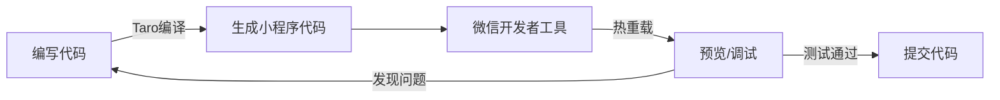

# Researchopia 微信小程序开发全流程方案

## 文档信息
- **版本**: v1.0
- **创建时间**: 2025-01-07
- **状态**: 开发方案
- **优先级**: 中
- **目标**: 将 https://www.researchopia.com/ 移植为微信小程序

---

## 1. 项目背景与目标

### 1.1 为什么要开发小程序?

**核心优势**:
- ✅ **用户习惯**: 微信11亿DAU,学术用户高度重合
- ✅ **无需安装**: 即用即走,降低使用门槛
- ✅ **流畅体验**: 原生组件,比H5更流畅
- ✅ **社交传播**: 分享论文/标注到微信好友/群聊
- ✅ **推送通知**: 模板消息提醒(会话邀请、新标注)

**与现有Web站的关系**:
```
┌─────────────────────────────────────────────┐
│           Researchopia 生态                  │
├─────────────────────────────────────────────┤
│  Web网站 (PC端主力)                          │
│  ↓                                          │
│  微信小程序 (移动端主力)                      │
│  ↓                                          │
│  Zotero插件 (桌面端深度集成)                 │
│  ↓                                          │
│  浏览器扩展 (Web辅助)                        │
└─────────────────────────────────────────────┘
         │
         └──▶ 共享后端: Supabase
```

### 1.2 功能范围定义

**MVP (Minimum Viable Product) 阶段**:
- ✅ 用户认证(微信登录)
- ✅ 论文搜索(DOI/标题)
- ✅ 论文详情展示
- ✅ 共享标注查看
- ✅ 文献共读会话(查看/加入)
- ✅ 个人中心

**进阶功能(二期)**:
- 📝 在线标注(PDF预览 + 文字高亮)
- 💬 标注评论/点赞
- 👥 用户关注/粉丝
- 📊 个人数据统计
- 🔔 消息通知(模板消息)
- 🌍 社区动态流

**暂不实现**:
- ❌ PDF完整阅读器(建议跳转Web或下载)
- ❌ 复杂图表渲染(技术受限)
- ❌ 视频/音频标注(小程序包体积限制)

---

## 2. 技术选型

### 2.1 开发框架对比

| 框架 | 优势 | 劣势 | 推荐度 |
|------|------|------|--------|
| **原生小程序** | 性能最优、文档全 | 开发效率低、代码冗余 | ⭐⭐⭐ |
| **uni-app** | 一次编写多端发布 | 性能略差、社区分散 | ⭐⭐⭐⭐ |
| **Taro** | React语法、组件丰富 | 编译后代码体积大 | ⭐⭐⭐⭐⭐ |
| **mpvue** | Vue语法、上手简单 | 已停止维护 | ⭐ |

**最终选择**: **Taro 4.x** (React语法)

**理由**:
1. 项目已使用React(Next.js),复用组件逻辑
2. TypeScript支持完善
3. 社区活跃,京东团队维护
4. 支持多端发布(后续可扩展到支付宝/百度小程序)
5. 组件库丰富(Taro UI)

### 2.2 技术栈

```
┌─────────────────────────────────────────────┐
│  前端层                                      │
│  - Taro 4.x (React 18)                      │
│  - TypeScript                                │
│  - Taro UI (UI组件库)                        │
│  - MobX (状态管理)                           │
│  - Taro-Axios (HTTP请求)                     │
└─────────────────────────────────────────────┘
         │
         ▼ HTTPS/WebSocket
┌─────────────────────────────────────────────┐
│  中间层                                      │
│  - Next.js API Routes (现有)                 │
│  - Vercel Edge Functions                    │
│  - 微信小程序服务端API                        │
└─────────────────────────────────────────────┘
         │
         ▼
┌─────────────────────────────────────────────┐
│  后端层                                      │
│  - Supabase (复用现有)                       │
│  - PostgreSQL (数据库)                       │
│  - Supabase Auth (认证)                      │
│  - Supabase Storage (文件存储)               │
└─────────────────────────────────────────────┘
```

**核心依赖**:
```json
{
  "dependencies": {
    "@tarojs/components": "4.1.0",
    "@tarojs/runtime": "4.1.0",
    "@tarojs/taro": "4.1.0",
    "@tarojs/plugin-platform-weapp": "4.1.0",
    "react": "^18.2.0",
    "react-dom": "^18.2.0",
    "mobx": "^6.13.5",
    "mobx-react": "^9.1.0",
    "taro-ui": "^3.3.1",
    "axios": "^1.12.2"
  },
  "devDependencies": {
    "@tarojs/cli": "4.1.0",
    "@tarojs/webpack5-runner": "4.1.0",
    "@types/react": "^18.2.0",
    "typescript": "^5.6.3",
    "eslint": "^9.15.0"
  }
}
```

---

## 3. 项目结构设计

### 3.1 目录结构

```
wechat-miniprogram/
├── project.config.json       # 微信开发者工具配置
├── package.json              # 项目依赖
├── tsconfig.json             # TypeScript配置
├── config/
│   ├── index.ts             # Taro基础配置
│   ├── dev.ts               # 开发环境配置
│   └── prod.ts              # 生产环境配置
├── src/
│   ├── app.config.ts        # 全局配置(页面路由、窗口样式)
│   ├── app.tsx              # 入口文件
│   ├── app.scss             # 全局样式
│   ├── index.html           # H5模板(可选)
│   ├── pages/               # 页面
│   │   ├── index/           # 首页
│   │   │   ├── index.tsx
│   │   │   ├── index.config.ts
│   │   │   └── index.scss
│   │   ├── search/          # 搜索页
│   │   ├── paper-detail/    # 论文详情
│   │   ├── session-list/    # 会话列表
│   │   ├── session-detail/  # 会话详情
│   │   ├── my-annotations/  # 我的标注
│   │   ├── profile/         # 个人中心
│   │   └── login/           # 登录页
│   ├── components/          # 组件
│   │   ├── PaperCard/       # 论文卡片
│   │   ├── AnnotationItem/  # 标注条目
│   │   ├── SessionCard/     # 会话卡片
│   │   ├── UserAvatar/      # 用户头像
│   │   └── EmptyState/      # 空状态
│   ├── services/            # 业务逻辑
│   │   ├── api.ts          # API封装
│   │   ├── auth.ts         # 认证服务
│   │   ├── paper.ts        # 论文服务
│   │   ├── session.ts      # 会话服务
│   │   └── annotation.ts   # 标注服务
│   ├── stores/              # 状态管理
│   │   ├── user.ts         # 用户状态
│   │   ├── paper.ts        # 论文状态
│   │   └── session.ts      # 会话状态
│   ├── utils/               # 工具函数
│   │   ├── request.ts      # HTTP请求封装
│   │   ├── storage.ts      # 本地存储
│   │   ├── logger.ts       # 日志工具
│   │   └── helpers.ts      # 通用工具
│   ├── types/               # TypeScript类型
│   │   ├── api.ts
│   │   ├── paper.ts
│   │   └── session.ts
│   └── constants/           # 常量
│       ├── config.ts       # 配置常量
│       └── enums.ts        # 枚举
└── dist/                    # 编译输出(gitignore)
```

### 3.2 核心配置文件

#### 3.2.1 project.config.json (微信开发者工具配置)
```json
{
  "miniprogramRoot": "dist/",
  "projectname": "researchopia",
  "description": "研学港 - 学术交流与共享平台",
  "appid": "wxXXXXXXXXXXXXXXXX",  // 需申请
  "setting": {
    "urlCheck": true,
    "es6": false,
    "enhance": true,
    "compileHotReLoad": true,
    "postcss": true,
    "minified": true,
    "babelSetting": {
      "ignore": [],
      "disablePlugins": [],
      "outputPath": ""
    }
  },
  "compileType": "miniprogram",
  "condition": {},
  "editorSetting": {
    "tabIndent": "insertSpaces",
    "tabSize": 2
  }
}
```

#### 3.2.2 config/index.ts (Taro配置)
```typescript
import { defineConfig, type UserConfigExport } from '@tarojs/cli'

export default defineConfig({
  projectName: 'researchopia-miniprogram',
  date: '2025-1-7',
  designWidth: 750,  // 设计稿宽度(基于750px)
  deviceRatio: {
    640: 2.34 / 2,
    750: 1,
    375: 2,
    828: 1.81 / 2
  },
  sourceRoot: 'src',
  outputRoot: 'dist',
  plugins: [],
  defineConstants: {},
  copy: {
    patterns: [],
    options: {}
  },
  framework: 'react',
  compiler: {
    type: 'webpack5',
    prebundle: { enable: false }
  },
  cache: {
    enable: false
  },
  mini: {
    postcss: {
      pxtransform: {
        enable: true,
        config: {
          selectorBlackList: ['van-']  // 忽略vant组件
        }
      },
      url: {
        enable: true,
        config: {
          limit: 1024  // 小于1kb转base64
        }
      },
      cssModules: {
        enable: false,
        config: {
          namingPattern: 'module',
          generateScopedName: '[name]__[local]___[hash:base64:5]'
        }
      }
    },
    webpackChain(chain) {
      // 自定义Webpack配置
    }
  },
  h5: {
    publicPath: '/',
    staticDirectory: 'static',
    output: {
      filename: 'js/[name].[hash:8].js',
      chunkFilename: 'js/[name].[chunkhash:8].js'
    },
    miniCssExtractPluginOption: {
      ignoreOrder: true,
      filename: 'css/[name].[hash].css',
      chunkFilename: 'css/[name].[chunkhash].css'
    },
    postcss: {
      autoprefixer: {
        enable: true
      }
    }
  }
})
```

#### 3.2.3 src/app.config.ts (全局配置)
```typescript
export default defineAppConfig({
  pages: [
    'pages/index/index',
    'pages/search/index',
    'pages/paper-detail/index',
    'pages/session-list/index',
    'pages/session-detail/index',
    'pages/my-annotations/index',
    'pages/profile/index',
    'pages/login/index'
  ],
  window: {
    backgroundTextStyle: 'light',
    navigationBarBackgroundColor: '#fff',
    navigationBarTitleText: '研学港',
    navigationBarTextStyle: 'black',
    enablePullDownRefresh: true
  },
  tabBar: {
    color: '#7A7E83',
    selectedColor: '#3cc51f',
    borderStyle: 'black',
    backgroundColor: '#ffffff',
    list: [
      {
        pagePath: 'pages/index/index',
        iconPath: 'assets/icons/home.png',
        selectedIconPath: 'assets/icons/home-active.png',
        text: '首页'
      },
      {
        pagePath: 'pages/search/index',
        iconPath: 'assets/icons/search.png',
        selectedIconPath: 'assets/icons/search-active.png',
        text: '搜索'
      },
      {
        pagePath: 'pages/session-list/index',
        iconPath: 'assets/icons/session.png',
        selectedIconPath: 'assets/icons/session-active.png',
        text: '共读'
      },
      {
        pagePath: 'pages/profile/index',
        iconPath: 'assets/icons/profile.png',
        selectedIconPath: 'assets/icons/profile-active.png',
        text: '我的'
      }
    ]
  },
  permission: {
    'scope.userLocation': {
      desc: '您的位置信息将用于小程序位置接口的效果展示'
    }
  },
  requiredPrivateInfos: [],
  lazyCodeLoading: 'requiredComponents'  // 按需注入
})
```

---

## 4. 核心功能实现

### 4.1 用户认证(微信登录)

#### 4.1.1 流程图
```
┌──────────────┐     ┌──────────────┐     ┌──────────────┐
│  小程序      │     │  Next.js API │     │  Supabase    │
│              │     │              │     │              │
│  wx.login()  │────▶│  /api/wx/    │────▶│  auth.       │
│              │     │  login       │     │  signIn()    │
│              │     │              │     │              │
│  获取token   │◀────│  返回JWT     │◀────│  返回JWT     │
│              │     │              │     │              │
│  存储token   │     │              │     │              │
│              │     │              │     │              │
│  请求API     │────▶│  验证token   │────▶│  RLS鉴权     │
└──────────────┘     └──────────────┘     └──────────────┘
```

#### 4.1.2 小程序端代码
```typescript
// src/services/auth.ts
import Taro from '@tarojs/taro'
import { request } from '@/utils/request'

export class AuthService {
  /**
   * 微信登录
   */
  static async login(): Promise<void> {
    try {
      // 1. 调用微信登录API
      const { code } = await Taro.login()
      
      if (!code) {
        throw new Error('获取微信登录code失败')
      }
      
      // 2. 调用后端API,用code换取token
      const res = await request({
        url: '/api/wx/login',
        method: 'POST',
        data: { code }
      })
      
      // 3. 存储token
      await Taro.setStorageSync('access_token', res.access_token)
      await Taro.setStorageSync('refresh_token', res.refresh_token)
      await Taro.setStorageSync('user', res.user)
      
      // 4. 更新全局状态
      const userStore = useUserStore()
      userStore.setUser(res.user)
      userStore.setToken(res.access_token)
      
      Taro.showToast({
        title: '登录成功',
        icon: 'success'
      })
      
    } catch (error) {
      console.error('[Auth] Login failed:', error)
      Taro.showToast({
        title: '登录失败,请重试',
        icon: 'none'
      })
      throw error
    }
  }
  
  /**
   * 检查登录状态
   */
  static async checkLoginStatus(): Promise<boolean> {
    try {
      const token = await Taro.getStorageSync('access_token')
      if (!token) return false
      
      // 验证token是否有效
      const res = await request({
        url: '/api/auth/verify',
        method: 'POST',
        data: { token }
      })
      
      return res.valid
    } catch (error) {
      return false
    }
  }
  
  /**
   * 退出登录
   */
  static async logout(): Promise<void> {
    await Taro.removeStorageSync('access_token')
    await Taro.removeStorageSync('refresh_token')
    await Taro.removeStorageSync('user')
    
    const userStore = useUserStore()
    userStore.clearUser()
    
    Taro.reLaunch({
      url: '/pages/login/index'
    })
  }
}
```

#### 4.1.3 后端API (Next.js)
```typescript
// src/app/api/wx/login/route.ts
import { NextRequest, NextResponse } from 'next/server'
import { createClient } from '@supabase/supabase-js'

const WECHAT_APP_ID = process.env.WECHAT_APP_ID!
const WECHAT_APP_SECRET = process.env.WECHAT_APP_SECRET!

export async function POST(request: NextRequest) {
  try {
    const { code } = await request.json()
    
    // 1. 用code换取openid和session_key
    const wxResponse = await fetch(
      `https://api.weixin.qq.com/sns/jscode2session?` +
      `appid=${WECHAT_APP_ID}&` +
      `secret=${WECHAT_APP_SECRET}&` +
      `js_code=${code}&` +
      `grant_type=authorization_code`
    )
    
    const wxData = await wxResponse.json()
    
    if (wxData.errcode) {
      return NextResponse.json(
        { error: '微信登录失败', details: wxData.errmsg },
        { status: 400 }
      )
    }
    
    const { openid, session_key } = wxData
    
    // 2. 在Supabase中查找或创建用户
    const supabase = createClient(
      process.env.NEXT_PUBLIC_SUPABASE_URL!,
      process.env.SUPABASE_SERVICE_ROLE_KEY!  // 使用Service Role Key
    )
    
    // 查找用户
    let { data: user } = await supabase
      .from('users')
      .select('*')
      .eq('wechat_openid', openid)
      .single()
    
    // 如果用户不存在,创建新用户
    if (!user) {
      const { data: newUser, error: createError } = await supabase
        .from('users')
        .insert({
          wechat_openid: openid,
          username: `微信用户_${openid.slice(0, 8)}`,
          created_at: new Date()
        })
        .select()
        .single()
      
      if (createError) throw createError
      user = newUser
    }
    
    // 3. 生成JWT token
    const { data: authData, error: signInError } = await supabase.auth.signInWithPassword({
      email: `${openid}@wechat.researchopia.com`,  // 虚拟邮箱
      password: session_key  // 使用session_key作为密码
    })
    
    // 如果用户不存在于auth.users表,先创建
    if (signInError) {
      const { data: authUser } = await supabase.auth.admin.createUser({
        email: `${openid}@wechat.researchopia.com`,
        password: session_key,
        email_confirm: true,
        user_metadata: {
          openid,
          platform: 'wechat'
        }
      })
      
      // 重新登录
      const { data: retryAuth } = await supabase.auth.signInWithPassword({
        email: `${openid}@wechat.researchopia.com`,
        password: session_key
      })
      
      return NextResponse.json({
        access_token: retryAuth?.session?.access_token,
        refresh_token: retryAuth?.session?.refresh_token,
        user: {
          id: user.id,
          username: user.username,
          avatar: user.avatar,
          openid: openid
        }
      })
    }
    
    return NextResponse.json({
      access_token: authData.session?.access_token,
      refresh_token: authData.session?.refresh_token,
      user: {
        id: user.id,
        username: user.username,
        avatar: user.avatar,
        openid: openid
      }
    })
    
  } catch (error) {
    console.error('[WX Login] Error:', error)
    return NextResponse.json(
      { error: '服务器错误' },
      { status: 500 }
    )
  }
}
```

### 4.2 论文搜索

```typescript
// src/pages/search/index.tsx
import { useState } from 'react'
import Taro from '@tarojs/taro'
import { View, Input, Button } from '@tarojs/components'
import { AtSearchBar } from 'taro-ui'
import { PaperService } from '@/services/paper'
import PaperCard from '@/components/PaperCard'
import EmptyState from '@/components/EmptyState'

export default function SearchPage() {
  const [keyword, setKeyword] = useState('')
  const [papers, setPapers] = useState([])
  const [loading, setLoading] = useState(false)
  
  const handleSearch = async () => {
    if (!keyword.trim()) {
      Taro.showToast({
        title: '请输入搜索关键词',
        icon: 'none'
      })
      return
    }
    
    setLoading(true)
    
    try {
      const results = await PaperService.search(keyword)
      setPapers(results)
      
      if (results.length === 0) {
        Taro.showToast({
          title: '未找到相关论文',
          icon: 'none'
        })
      }
    } catch (error) {
      Taro.showToast({
        title: '搜索失败,请重试',
        icon: 'none'
      })
    } finally {
      setLoading(false)
    }
  }
  
  const handlePaperClick = (doi: string) => {
    Taro.navigateTo({
      url: `/pages/paper-detail/index?doi=${encodeURIComponent(doi)}`
    })
  }
  
  return (
    <View className='search-page'>
      <AtSearchBar
        value={keyword}
        onChange={setKeyword}
        onActionClick={handleSearch}
        placeholder='搜索DOI或论文标题'
      />
      
      {loading && (
        <View className='loading'>
          <AtActivityIndicator />
        </View>
      )}
      
      {!loading && papers.length === 0 && (
        <EmptyState
          icon='search'
          text='暂无搜索结果'
        />
      )}
      
      {!loading && papers.length > 0 && (
        <View className='results'>
          {papers.map(paper => (
            <PaperCard
              key={paper.doi}
              paper={paper}
              onClick={() => handlePaperClick(paper.doi)}
            />
          ))}
        </View>
      )}
    </View>
  )
}
```

### 4.3 论文详情

```typescript
// src/pages/paper-detail/index.tsx
import { useEffect, useState } from 'react'
import Taro, { useRouter } from '@tarojs/taro'
import { View, Text, Button } from '@tarojs/components'
import { PaperService } from '@/services/paper'
import { AnnotationService } from '@/services/annotation'
import AnnotationItem from '@/components/AnnotationItem'

export default function PaperDetailPage() {
  const router = useRouter()
  const { doi } = router.params
  
  const [paper, setPaper] = useState(null)
  const [annotations, setAnnotations] = useState([])
  const [loading, setLoading] = useState(true)
  
  useEffect(() => {
    if (doi) {
      loadPaperDetail(decodeURIComponent(doi))
    }
  }, [doi])
  
  const loadPaperDetail = async (doi: string) => {
    try {
      setLoading(true)
      
      // 并行加载论文详情和标注
      const [paperData, annotationsData] = await Promise.all([
        PaperService.getByDOI(doi),
        AnnotationService.getByDOI(doi)
      ])
      
      setPaper(paperData)
      setAnnotations(annotationsData)
      
    } catch (error) {
      Taro.showToast({
        title: '加载失败',
        icon: 'none'
      })
    } finally {
      setLoading(false)
    }
  }
  
  const handleShare = () => {
    Taro.showShareMenu({
      withShareTicket: true,
      menus: ['shareAppMessage', 'shareTimeline']
    })
  }
  
  // 分享配置
  Taro.useShareAppMessage(() => {
    return {
      title: paper?.title || '研学港 - 学术论文',
      path: `/pages/paper-detail/index?doi=${encodeURIComponent(doi)}`,
      imageUrl: 'https://www.researchopia.com/og-image.png'
    }
  })
  
  return (
    <View className='paper-detail-page'>
      {loading && <AtActivityIndicator />}
      
      {!loading && paper && (
        <>
          {/* 论文信息 */}
          <View className='paper-info'>
            <Text className='title'>{paper.title}</Text>
            <Text className='authors'>{paper.authors?.join(', ')}</Text>
            <Text className='journal'>{paper.journal}</Text>
            <Text className='doi'>DOI: {paper.doi}</Text>
          </View>
          
          {/* 操作按钮 */}
          <View className='actions'>
            <Button onClick={handleShare}>分享</Button>
            <Button onClick={() => Taro.navigateTo({
              url: `/pages/session-list/index?doi=${doi}`
            })}>
              查看共读会话
            </Button>
          </View>
          
          {/* 摘要 */}
          {paper.abstract && (
            <View className='abstract'>
              <Text className='section-title'>摘要</Text>
              <Text className='content'>{paper.abstract}</Text>
            </View>
          )}
          
          {/* 共享标注 */}
          <View className='annotations'>
            <Text className='section-title'>
              共享标注 ({annotations.length})
            </Text>
            
            {annotations.length === 0 && (
              <EmptyState
                icon='annotation'
                text='暂无标注'
              />
            )}
            
            {annotations.map(annotation => (
              <AnnotationItem
                key={annotation.id}
                annotation={annotation}
              />
            ))}
          </View>
        </>
      )}
    </View>
  )
}
```

### 4.4 状态管理 (MobX)

```typescript
// src/stores/user.ts
import { makeAutoObservable } from 'mobx'
import Taro from '@tarojs/taro'

export class UserStore {
  user: User | null = null
  token: string | null = null
  isLoggedIn: boolean = false
  
  constructor() {
    makeAutoObservable(this)
    this.loadFromStorage()
  }
  
  async loadFromStorage() {
    try {
      const user = await Taro.getStorageSync('user')
      const token = await Taro.getStorageSync('access_token')
      
      if (user && token) {
        this.user = user
        this.token = token
        this.isLoggedIn = true
      }
    } catch (error) {
      console.error('[UserStore] Load from storage failed:', error)
    }
  }
  
  setUser(user: User) {
    this.user = user
    this.isLoggedIn = true
  }
  
  setToken(token: string) {
    this.token = token
  }
  
  clearUser() {
    this.user = null
    this.token = null
    this.isLoggedIn = false
  }
}

export const userStore = new UserStore()
```

---

## 5. 开发流程

### 5.1 环境搭建

#### 5.1.1 安装依赖工具

```bash
# 1. 安装Node.js (推荐v18+)
node -v

# 2. 安装Taro CLI
npm install -g @tarojs/cli@4.1.0

# 3. 下载微信开发者工具
# https://developers.weixin.qq.com/miniprogram/dev/devtools/download.html
```

#### 5.1.2 创建项目

```bash
# 1. 创建Taro项目
taro init researchopia-miniprogram

# 选择配置:
# - 框架: React
# - TypeScript: Yes
# - CSS预处理器: Sass
# - 模板: 默认模板

# 2. 进入项目目录
cd researchopia-miniprogram

# 3. 安装依赖
npm install

# 4. 启动开发服务器
npm run dev:weapp
```

#### 5.1.3 配置微信开发者工具

1. 打开微信开发者工具
2. 导入项目 → 选择 `dist/` 目录
3. 填写 AppID (先用测试号)
4. 开启"不校验合法域名"(开发阶段)

### 5.2 开发工作流



**关键命令**:
```bash
# 开发模式(热重载)
npm run dev:weapp

# 构建生产版本
npm run build:weapp

# 多端构建
npm run build:h5        # H5版本
npm run build:alipay    # 支付宝小程序
npm run build:swan      # 百度小程序
```

### 5.3 调试技巧

#### 5.3.1 真机调试
```bash
# 1. 微信开发者工具 → 预览
# 2. 手机扫码
# 3. 开启vconsole调试
```

```typescript
// src/app.tsx
if (process.env.NODE_ENV === 'development') {
  // 开启vconsole
  const vConsole = new VConsole()
}
```

#### 5.3.2 网络请求调试
```typescript
// src/utils/request.ts
import Taro from '@tarojs/taro'

Taro.addInterceptor(Taro.interceptors.logInterceptor)  // 打印请求日志

export function request(options) {
  console.log('[Request]', options.url, options.data)
  
  return Taro.request({
    ...options,
    header: {
      'Authorization': `Bearer ${getToken()}`,
      ...options.header
    }
  }).then(res => {
    console.log('[Response]', res.data)
    return res.data
  }).catch(err => {
    console.error('[Request Error]', err)
    throw err
  })
}
```

---

## 6. 测试与优化

### 6.1 性能优化

#### 6.1.1 代码包优化
```javascript
// config/index.ts
export default {
  mini: {
    // 分包配置
    subpackages: [
      {
        root: 'pages/session',
        pages: [
          'session-list/index',
          'session-detail/index'
        ]
      },
      {
        root: 'pages/profile',
        pages: [
          'profile/index',
          'my-annotations/index'
        ]
      }
    ],
    // 预加载
    preloadRule: {
      'pages/index/index': {
        network: 'all',
        packages: ['pages/session']
      }
    }
  }
}
```

#### 6.1.2 图片优化
```typescript
// 使用WebP格式
<Image src='https://cdn.researchopia.com/image.webp' />

// CDN加速
const IMAGE_CDN = 'https://cdn.researchopia.com'
<Image src={`${IMAGE_CDN}/avatar/${user.id}.webp`} />

// 懒加载
<Image src={imageSrc} lazyLoad />
```

#### 6.1.3 数据缓存
```typescript
// src/services/paper.ts
import Taro from '@tarojs/taro'

export class PaperService {
  private static CACHE_KEY = 'paper_cache'
  private static CACHE_DURATION = 5 * 60 * 1000  // 5分钟
  
  static async getByDOI(doi: string) {
    // 先查缓存
    const cached = await this.getFromCache(doi)
    if (cached) return cached
    
    // 请求API
    const paper = await request({
      url: `/api/papers/${doi}`
    })
    
    // 写入缓存
    await this.saveToCache(doi, paper)
    
    return paper
  }
  
  private static async getFromCache(doi: string) {
    try {
      const cache = await Taro.getStorageSync(this.CACHE_KEY) || {}
      const item = cache[doi]
      
      if (item && Date.now() - item.timestamp < this.CACHE_DURATION) {
        return item.data
      }
    } catch (error) {
      return null
    }
  }
  
  private static async saveToCache(doi: string, data: any) {
    try {
      const cache = await Taro.getStorageSync(this.CACHE_KEY) || {}
      cache[doi] = {
        data,
        timestamp: Date.now()
      }
      await Taro.setStorageSync(this.CACHE_KEY, cache)
    } catch (error) {
      console.error('[Cache] Save failed:', error)
    }
  }
}
```

### 6.2 体验评分

微信小程序体验分 = 性能分 × 0.5 + 体验分 × 0.3 + 最佳实践分 × 0.2

**优化目标**:
- 性能分 > 85分
- 体验分 > 90分
- 最佳实践分 > 95分

**关键指标**:
- 首屏渲染时间 < 2秒
- 代码包大小 < 2MB (主包 < 500KB)
- 图片加载耗时 < 1秒

---

## 7. 上线流程

### 7.1 准备工作清单

#### 7.1.1 微信公众平台注册

**步骤**:
1. 访问 https://mp.weixin.qq.com/
2. 注册小程序账号
3. 选择主体类型(企业/个人)
4. 完成认证(企业需营业执照,个人需身份证)
5. 获取 `AppID` 和 `AppSecret`

**费用**:
- 个人主体: 免费
- 企业主体: ¥300/年(微信认证费)

#### 7.1.2 配置服务器域名

登录微信公众平台 → 开发 → 开发管理 → 开发设置 → 服务器域名

**需要配置的域名**:
```
request合法域名:
  - https://www.researchopia.com
  - https://api.researchopia.com
  - https://XXXXXXX.supabase.co

uploadFile合法域名:
  - https://XXXXXXX.supabase.co

downloadFile合法域名:
  - https://cdn.researchopia.com
  - https://XXXXXXX.supabase.co

socket合法域名:
  - wss://realtime.supabase.co
```

**注意**:
- 必须是HTTPS
- 域名需完成ICP备案
- 每月只能修改5次

#### 7.1.3 隐私协议

在微信公众平台配置:
- 用户隐私保护指引
- 收集的用户信息类型
- 数据使用说明

### 7.2 构建与上传

#### 7.2.1 生产环境配置

```typescript
// config/prod.ts
export default {
  env: {
    API_BASE_URL: 'https://www.researchopia.com/api',
    SUPABASE_URL: process.env.NEXT_PUBLIC_SUPABASE_URL,
    SUPABASE_ANON_KEY: process.env.NEXT_PUBLIC_SUPABASE_ANON_KEY
  },
  defineConstants: {
    'process.env.NODE_ENV': JSON.stringify('production')
  },
  mini: {
    minified: true,  // 压缩代码
    sourceMapType: 'hidden-source-map'  // 生成sourcemap但不打包
  }
}
```

#### 7.2.2 构建生产版本

```bash
# 1. 清理缓存
rm -rf dist/
rm -rf node_modules/.cache/

# 2. 安装依赖
npm ci  # 使用package-lock.json确保一致性

# 3. 构建
npm run build:weapp

# 4. 检查包大小
du -sh dist/
```

#### 7.2.3 上传代码

**方式一: 微信开发者工具**
1. 打开微信开发者工具
2. 点击"上传"按钮
3. 填写版本号和备注
4. 点击确认上传

**方式二: CLI工具(推荐)**
```bash
# 安装miniprogram-ci
npm install miniprogram-ci -g

# 上传代码
miniprogram-ci upload \
  --pp ./project.config.json \
  --pkp ./private.key \
  --appid wxXXXXXXXXXXXXXXXX \
  --uv 1.0.0 \
  --ud "首次发布"
```

### 7.3 提交审核

#### 7.3.1 在微信公众平台提交审核

登录微信公众平台 → 版本管理 → 开发版本 → 提交审核

**必填信息**:
- 小程序名称: 研学港
- 小程序简介: 学术论文交流与共享平台
- 服务类目: 教育 → 在线教育
- 标签: 学术、论文、科研、阅读
- 测试账号(可选)

#### 7.3.2 功能页面截图

准备4-5张真机截图(750x1334px):
- 首页
- 搜索页
- 论文详情
- 共读会话
- 个人中心

#### 7.3.3 审核要点

**易被拒绝的情况**:
- ❌ 使用"微信"等保留词
- ❌ 需要强制关注公众号
- ❌ 存在诱导分享
- ❌ 未完成的功能
- ❌ 违反内容规范

**审核周期**: 通常1-7个工作日

### 7.4 发布上线

审核通过后:
1. 登录微信公众平台
2. 版本管理 → 审核版本 → 提交发布
3. 全量发布或灰度发布(分阶段放量)

**灰度发布建议**:
- 第1天: 5%用户
- 第3天: 20%用户
- 第7天: 50%用户
- 第14天: 100%用户

---

## 8. 运营与监控

### 8.1 数据统计

#### 8.1.1 微信官方统计

登录微信公众平台 → 统计 → 访问分析

**关键指标**:
- 日活用户(DAU)
- 新增用户
- 访问次数
- 页面访问深度
- 分享次数

#### 8.1.2 自定义埋点

```typescript
// src/utils/analytics.ts
import Taro from '@tarojs/taro'

export class Analytics {
  /**
   * 页面浏览
   */
  static trackPageView(pageName: string) {
    Taro.reportAnalytics('page_view', {
      page_name: pageName,
      timestamp: Date.now()
    })
  }
  
  /**
   * 事件追踪
   */
  static trackEvent(eventName: string, params?: Record<string, any>) {
    Taro.reportAnalytics(eventName, {
      ...params,
      timestamp: Date.now()
    })
  }
  
  /**
   * 搜索追踪
   */
  static trackSearch(keyword: string, resultCount: number) {
    this.trackEvent('search', {
      keyword,
      result_count: resultCount
    })
  }
  
  /**
   * 论文查看
   */
  static trackPaperView(doi: string) {
    this.trackEvent('paper_view', { doi })
  }
}
```

### 8.2 错误监控

```typescript
// src/app.tsx
import Taro from '@tarojs/taro'

class App {
  onError(error: string) {
    console.error('[Global Error]', error)
    
    // 上报到服务器
    Taro.request({
      url: 'https://www.researchopia.com/api/log/error',
      method: 'POST',
      data: {
        error,
        platform: 'wechat-miniprogram',
        timestamp: Date.now(),
        user_id: getUserId()
      }
    })
  }
  
  onPageNotFound(res) {
    console.error('[Page Not Found]', res)
    
    // 重定向到首页
    Taro.redirectTo({
      url: '/pages/index/index'
    })
  }
}
```

### 8.3 用户反馈

```typescript
// src/pages/profile/index.tsx
const handleFeedback = () => {
  Taro.navigateToMiniProgram({
    appId: 'wxXXXXXXXXXXXXXXXX',  // 微信客服小程序
    path: 'pages/index/index',
    extraData: {
      source: 'researchopia'
    }
  })
}
```

---

## 9. 成本估算

### 9.1 开发成本

| 阶段 | 人力 | 工时 | 说明 |
|------|------|------|------|
| **需求设计** | 1人 | 3天 | 功能梳理、原型设计 |
| **环境搭建** | 1人 | 1天 | Taro项目初始化 |
| **核心功能开发** | 2人 | 15天 | 登录、搜索、详情、会话 |
| **UI/UX优化** | 1人 | 5天 | 样式美化、交互优化 |
| **测试修复** | 1人 | 5天 | 真机测试、bug修复 |
| **上线部署** | 1人 | 2天 | 审核提交、发布配置 |
| **总计** | | **31天** | |

**人力成本**: 2人 × 1个月 ≈ **2人月**

### 9.2 运营成本

| 项目 | 费用 | 周期 | 说明 |
|------|------|------|------|
| **微信认证** | ¥300 | 年 | 企业主体必须 |
| **服务器域名HTTPS** | ¥0 | 年 | 复用现有(Let's Encrypt免费) |
| **CDN流量** | ¥50 | 月 | 图片/静态资源加速 |
| **后端API** | ¥0 | 月 | 复用Supabase (免费额度) |
| **年度总计** | **¥900** | | |

### 9.3 推广成本(可选)

| 渠道 | 费用 | 效果 |
|------|------|------|
| **微信搜索广告** | ¥5000/月 | 精准获客 |
| **公众号推文** | ¥2000/篇 | 内容营销 |
| **学术社群合作** | ¥0 | 免费推广 |

---

## 10. 风险与应对

### 10.1 技术风险

| 风险 | 等级 | 应对措施 |
|------|------|----------|
| 小程序包体积超限(2MB) | 🟡 中 | 分包加载 + 图片CDN |
| PDF渲染性能差 | 🟡 中 | 降级为文本预览 + 跳转Web |
| 微信API限制(如WebSocket) | 🟢 低 | 使用Supabase Realtime适配 |

### 10.2 审核风险

| 风险 | 等级 | 应对措施 |
|------|------|----------|
| 内容审核不通过 | 🟡 中 | 添加内容举报功能 + 敏感词过滤 |
| 功能被认为"诱导分享" | 🟢 低 | 分享功能设计符合规范 |
| 类目选择不当 | 🟢 低 | 选择"教育-在线教育"类目 |

### 10.3 运营风险

| 风险 | 等级 | 应对措施 |
|------|------|----------|
| 用户活跃度低 | 🟡 中 | 消息通知 + 积分激励 |
| 服务器成本超支 | 🟢 低 | Supabase免费额度足够 |

---

## 11. 里程碑计划

### Week 1: 项目初始化
- [x] Taro项目搭建
- [x] 目录结构设计
- [x] 开发环境配置
- [x] 微信开发者工具调试

### Week 2: 核心功能开发
- [ ] 微信登录
- [ ] 论文搜索
- [ ] 论文详情
- [ ] 状态管理

### Week 3: 高级功能开发
- [ ] 共读会话列表
- [ ] 会话详情
- [ ] 标注查看
- [ ] 个人中心

### Week 4: 优化与测试
- [ ] UI/UX优化
- [ ] 性能优化(分包、缓存)
- [ ] 真机测试
- [ ] Bug修复

### Week 5: 上线准备
- [ ] 生产环境配置
- [ ] 代码审查
- [ ] 提交审核
- [ ] 发布上线

---

## 12. 后续规划

### 短期(3个月)
- [ ] 添加在线标注功能(PDF高亮)
- [ ] 消息通知(模板消息)
- [ ] 用户关注/粉丝系统
- [ ] 数据统计优化

### 中期(6个月)
- [ ] AI论文摘要
- [ ] 知识图谱可视化
- [ ] 个人学术主页
- [ ] 社区动态流

### 长期(1年)
- [ ] 多端发布(支付宝/百度小程序)
- [ ] 企业版功能(团队协作)
- [ ] 付费增值服务
- [ ] 国际化支持

---

## 附录

### A. 参考资料

- 微信小程序官方文档: https://developers.weixin.qq.com/miniprogram/dev/framework/
- Taro官方文档: https://taro-docs.jd.com/
- Taro UI组件库: https://taro-ui.jd.com/
- Supabase文档: https://supabase.com/docs

### B. 示例代码仓库

- Researchopia Web: https://github.com/your-org/researchopia
- Researchopia 小程序: https://github.com/your-org/researchopia-miniprogram

### C. 联系方式

- 技术支持: tech@researchopia.com
- 商务合作: business@researchopia.com

---

**文档结束**

**维护者**: Researchopia Team  
**最后更新**: 2025-01-07
